# 测试 <a href="https://player.bilibili.com/player.html?aid=60016166&cid=104514776&page=1&danmaku=0" target="_blank">演示视频</a>

<iframe src="//player.bilibili.com/player.html?aid=60016166&cid=104514776&page=1&danmaku=0" allowfullscreen="allowfullscreen" width="100%" height="500" scrolling="no" frameborder="0" sandbox="allow-top-navigation allow-same-origin allow-forms allow-scripts"></iframe>

面向对象是写 Java 程序的核心套路，如何你不懂面向对象，那就相当于 Java 你白学了。

前面我们说过面向对象最核心的套路是：**设计对象来处理数据，解决问题。** 如果你把面向对象高级这一部分课程学好，你设计出来的对象将更加好用。

## 静态

接下来，我们学习一下面向对象编程中很常见的一个关键字 static.

static 读作静态，可以用来修饰成员变量，也能修饰成员方法。我们先来学习 static 修饰成员变量。

### static 修饰成员变量

Java 中的成员变量按照有无 static 修饰分为两种：**类变量、实例变量**。它们的区别如下图所示：

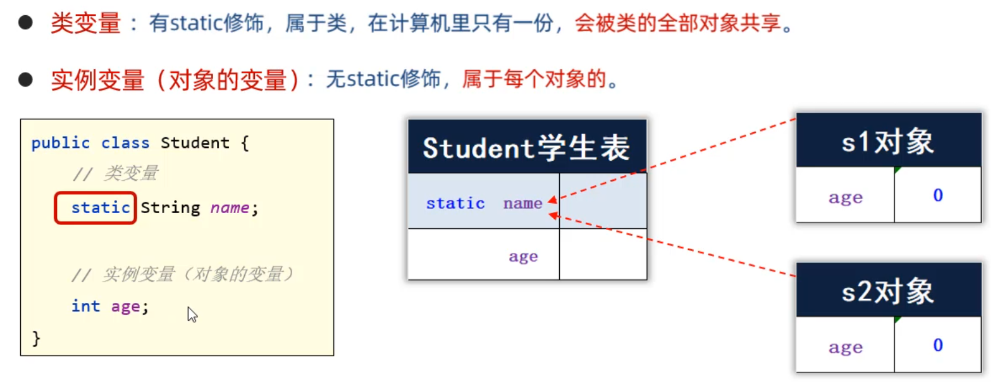

由于静态变量是属于类的，只需要通过类名就可以调用：**`类名.静态变量`**

实例变量是属于对象的，需要通过对象才能调用：**`对象.实例变量`**

- 下面是代码演示（注意静态变量，和实例变量是如何调用的）

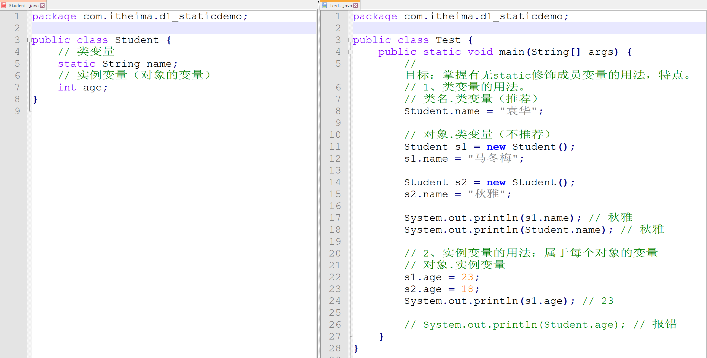

为了让大家对于这两种成员变量的执行过程理解更清楚一点，在这里给大家在啰嗦几句，我们来看一下上面代码的内存原理。

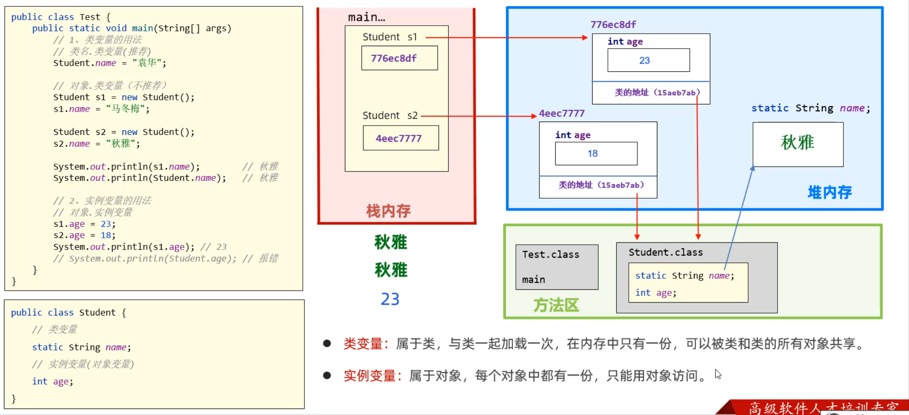

- **最后总结一下**

```java
- 1.类变量：属于类，在内存中只有一份，用类名调用
- 2.实例变量：属于对象，每一个对象都有一份，用对象调用
```

### static 修饰成员变量的应用场景

学习完 static 修饰成员变量的基本使用之后，接下来我们学习一下 static 修饰成员变量在实际工作中的应用。

在实际开发中，如果某个数据只需要一份，且希望能够被共享（访问、修改），则该数据可以定义成类变量来记住。

> **我们看一个案例**
>
> **需求：系统启动后，要求用于类可以记住自己创建了多少个用户对象。**

- 第一步：先定义一个`User`类，在用户类中定义一个 static 修饰的变量，用来表示在线人数；

```java
public class User{
    public static int number;
    //每次创建对象时，number自增一下
    public User(){
        User.number++;
    }
}
```

- 第二步：再写一个测试类，再测试类中创建 4 个 User 对象，再打印 number 的值，观察 number 的值是否再自增。

```java
public class Test{
    public static void main(String[] args){
        //创建4个对象
        new User();
        new User();
        new User();
        new User();

        //查看系统创建了多少个User对象
        System.out.println("系统创建的User对象个数：" + User.number);
    }
}
```

运行上面的代码，查看执行结果是：**`系统创建的User对象个数：4`**

### static 修饰成员方法

学习完 static 修饰成员变量之后，接下来我们学习 static 修饰成员方法。成员方法根据有无 static 也分为两类：**类方法、实例方法**

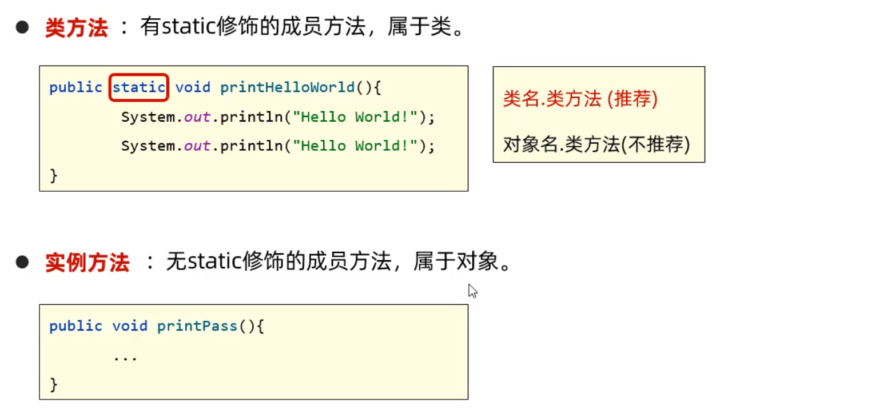

> 有 static 修饰的方法，是属于类的，称为**类方法**；调用时直接用类名调用即可。
>
> 无 static 修饰的方法，是属于对象的，称为实例方法；调用时，需要使用对象调用。

我们看一个案例，演示类方法、实例方法的基本使用

- 先定义一个 Student 类，在类中定义一个类方法、定义一个实例方法

```java
public class Student{
    double score;

    // 类方法：
    public static void printHelloWorld{
      System.out.println("Hello World!");
      System.out.println("Hello World!");
    }

    // 实例方法（对象的方法）
    public void printPass(){
      // 打印成绩是否合格
      System.out.println(score >= 60 ? "成绩合格" : "成绩不合格");
    }
}
```

- 在定义一个测试类，注意类方法、对象方法调用的区别

```java
public class Test2 {
    public static void main(String[] args){
        // 1.调用Student类中的类方法
        Student.printHelloWorld();

        // 2.调用Student类中的实例方法
        Student s = new Student();
        s.printPass();

        // 使用对象也能调用类方法【不推荐，IDEA连提示都不给你，你就别这么用了】
        s.printHelloWorld();
    }
}
```

搞清楚类方法和实例方法如何调用之后，接下来再聊一聊 static 修饰成员方法的内存原理。

```java
1.类方法：static修饰的方法，可以被类名调用，是因为它是随着类的加载而加载的；
		 所以类名直接就可以找到static修饰的方法

2.实例方法：非static修饰的方法，需要创建对象后才能调用，是因为实例方法中可能会访问实例变量，而实例变量需要创建对象后才存在。
		  所以实例方法，必须创建对象后才能调用。
```

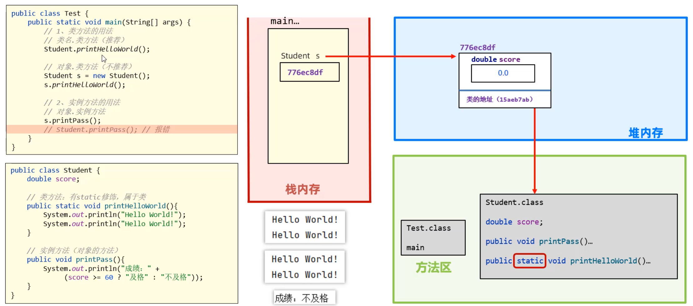

关于 static 修饰成员变量、和静态修饰成员方法这两种用法，到这里就学习完了。

### 工具类

学习完 static 修饰方法之后，我们讲一个有关类方法的应用知识，叫做工具类。

如果一个类中的方法全都是静态的，那么这个类中的方法就全都可以被类名直接调用，由于调用起来非常方便，就像一个工具一下，所以把这样的类就叫做工具类。

- 我们写一个生成验证码的工具类

```java
public class MyUtils {
    public static String createCode(int n){
        //1.定义一个字符串，用来记录产生的验证码
        String code = "";

        //2.验证码是由所有的大写字母、小写字母或者数字字符组成
        //这里先把所有的字符写成一个字符串，一会从字符串中随机找字符
        String data = "0123456789abcdefghijklmnopqrstuvwxyzABCDEFGHIJKMNOPQRSTUVWXYZ";

        //3.循环n次，产生n个索引,再通过索引获取字符
        Random r = new Random();
        for(int i = 0; i < n; i++){
            int index = r.nextInt(data.length());
            char ch = data.charAt(index);
            //4.把获取到的字符，拼接到code验证码字符串上。
            code += ch;
        }

        //最后返回code,code的值就是验证码
        return code;
    }
}
```

```java
// 比如这是一个注册界面
public class registerDemo{
  public static void main(String[] args) {
    System.out.println(MyUtils.createCode());
  }
}
```

工具类的使用就是这样子的，学会了吗？

> 在补充一点，工具类里的方法全都是静态的，推荐用类名调用为了防止使用者用对象调用。我们可以把工具类的构造方法私有化。

```java
public class MyUtils {
    //私有化构造方法：这样别人就不能使用构造方法new对象了
    private MyUtils() {
    }
    //类方法
    public static String createCode(int n) {
       ...
    }
}
```

### static 的注意事项

到现在在我们已经学会了 static 修饰的变量、方法如何调用了。但是有一些注意事项还是需要给大家说明一下，目的是让大家知道，使用 static 写代码时，如果出错了，要知道为什么错、如何改正。

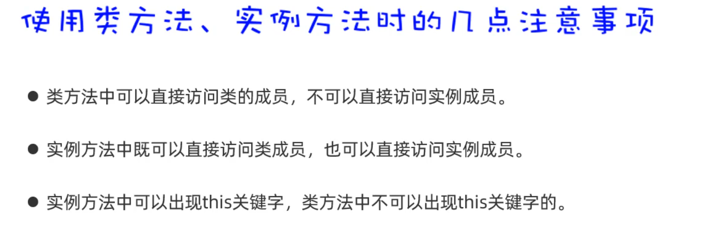

```java
public class Student {
    static String schoolName; // 类变量
    double score; // 实例变量

    // 1、类方法中可以直接访问类的成员，不可以直接访问实例成员。
    public static void printHelloWorld(){
        // 注意：同一个类中，访问类成员，可以省略类名不写。
        schoolName = "清华";
        printHelloWorld2();

        System.out.println(score); // 报错的
        printPass(); // 报错的

        system.out.println(this); // 报错的
    }

	  // 类方法
    public static void printHelloWorld2(){

    }

    // 实例方法
    public void printPass2(){

    }

    // 实例方法
    // 2、实例方法中既可以直接访问类成员，也可以直接访问实例成员。
    // 3、实例方法中可以出现this关键字，类方法中不可以出现this关键字的
    public void printPass(){
        schoolName = "北大"; // 对的
        printHelloWorld2(); // 对的

        System.out.println(score); //对的
        printPass2(); //对的

        System.out.println(this); //对的
    }
}
```

### static 应用（代码块）

接下来我们再补充讲解一个知识点，叫代码块；代码块根据有无 static 修饰分为两种：静态代码块、实例代码块

> **我们先类学习静态代码块：**

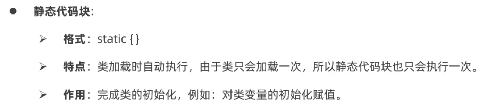

```java
public class Student {
    static int number = 80;
    static String schoolName = "黑马";
    // 静态代码块
    static {
        System.out.println("静态代码块执行了~~");
        schoolName = "黑马";
    }
}
```

静态代码块不需要创建对象就能够执行

```java
public class Test {
    public static void main(String[] args) {
        // 目标：认识两种代码块，了解他们的特点和基本作用。
        System.out.println(Student.number);
        System.out.println(Student.number);
        System.out.println(Student.number);

        System.out.println(Student.schoolName);
    }
}
```

执行上面代码时，发现没有创建对象，静态代码块就已经执行了。

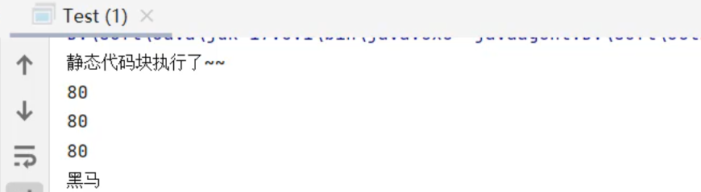

关于静态代码块重点注意：**静态代码块，随着类的加载而执行，而且只执行一次。**

**再来学习一下实例代码块**

> 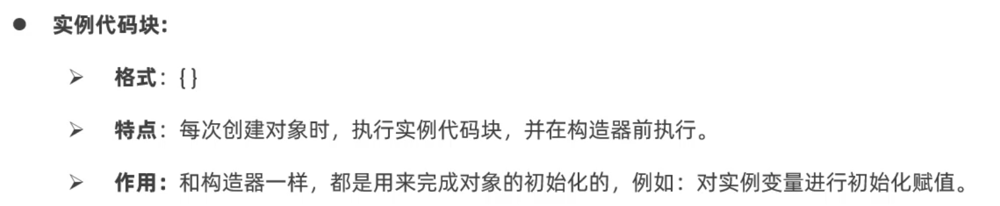

实例代码块的作用和构造器的作用是一样的，用来给对象初始化值；而且每次创建对象之前都会先执行实例代码块。

```java
public class Student{
  // 实例变量
	int age;
    // 实例代码块：实例代码块会执行在每一个构造方法之前
    {
        System.out.println("实例代码块执行了~~");
        age = 18;
        System.out.println("有人创建了对象：" + this);
    }

    public Student(){
        System.out.println("无参数构造器执行了~~");
    }

    public Student(String name){
        System.out.println("有参数构造器执行了~~");
    }
}

实例代码块执行了~~
有人创建了对象：day14.Student@21bcffb5
无参数构造器执行了~~
实例代码块执行了~~
有人创建了对象：day14.Student@380fb434
有参数构造器执行了~~
18
18
```

对于实例代码块重点注意：**实例代码块每次创建对象之前都会执行一次**

### static 应用（单例设计模式）

关于 static 的应用我们再补充一个使用的技巧，叫做单例设计模式。

所谓设计模式指的是，一类问题可能会有多种解决方案，而设计模式是在编程实践中，多种方案中的一种最优方案。

```public class A {
    // 2、定义一个类变量记住类的一个对象
    private static A a = new A();

    // 1、必须私有类的构造器
    private A() {

    }

    // 3、定义一个类方法返回类的对象
    public static A getObject(){
        return a;
    }
}
```

```
public class Test1 {
    public static void main(String[] args) {
        // 目标：掌握单例设计模式的写法。
        A a1 = A.getObject();
        A a2 = A.getObject();
        System.out.println(a1);
        System.out.println(a2);
    }
}
```

懒汉单例模式
● 定义一个类，把构造器私有。
● 定义一个静态变量存储一个对象。
● 提供一个返回单例对象的方法

```
public class B {
    // 2、定义一个类变量，用于存储这个类的一个对象。
    private static B b;

    // 1、把类的构造器私有
    private B(){

    }

    // 3、定义一个类方法，这个方法要保证第一次调用时才创建一个对象，后面调用时都会用这同一个对象返回。
    public static B getInstance(){
        if(b == null){
            System.out.println("第一次创建对象~");
            b = new B();
        }
        return b;
    }
}
```

```
/**
 * 目标：掌握懒汉式单例的写法。
 */
public class Test2 {
    public static void main(String[] args) {
        B b1 = B.getInstance(); // 第一次拿对象
        B b2 = B.getInstance();
        System.out.println(b1 == b2);
    }
}
```

关于静态的使用到这里，我们就学习完了。

## 继承

### 继承快速入门

我们继续学习面向对象相关内容。面向对象编程之所以能够能够被广大开发者认可，有一个非常重要的原因，是因为它有三大特征，继承、封装和多态。封装我们在之前已经学过了，接下来我们学习一下继承。

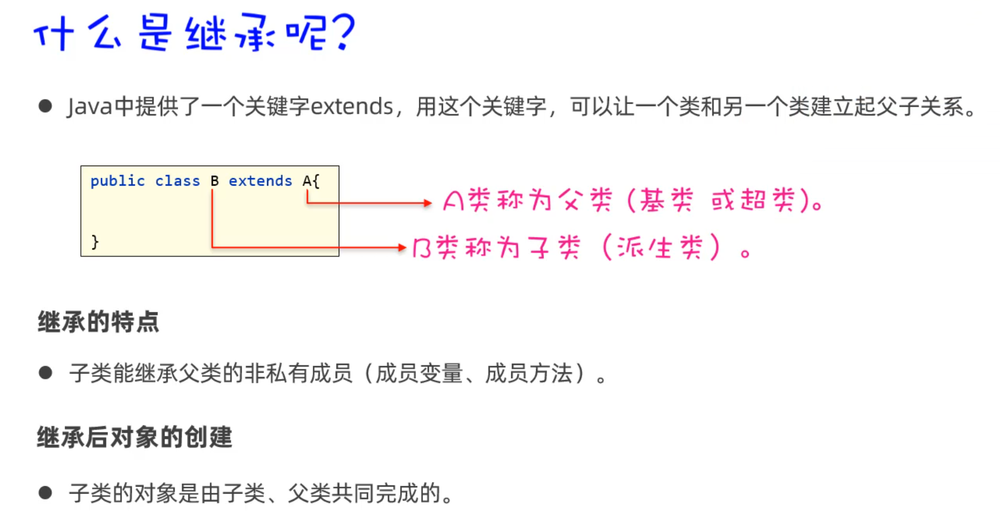

接下来，我们演示一下使用继承来编写代码，注意观察继承的特点。

```java
public class A {
    //公开的成员
    public int i;
    public void print1() {
        System.out.println("===print1===");
    }

    //私有的成员
    private int j;
    private void print2() {
        System.out.println("===print2===");
    }
}
```

然后，写一个 B 类，让 B 类继承 A 类。在继承 A 类的同时，B 类中新增一个方法 print3

```java
public class B extends A{
    public void print3(){
        // 由于i和print1是属于父类A的公有成员，在子类中可以直接被使用
        System.out.println(i); // 正确
        print1(); //正确

        // 由于j和print2是属于父类A的私有成员，在子类中不可以被使用
        System.out.println(j); // 错误
        print2();
    }
}
```

接下来，我们再演示一下，创建 B 类对象，能否调用父类 A 的成员。再写一个测试类

```java
public class Test {
    public static void main(String[] args){
        B b = new B();
        // 父类公有成员，子类对象是可以调用的
        System.out.println(i); //正确
        b.print1();

        // 父类私有成员，子类对象时不可以调用的
        System.out.println(j); //错误
        b.print2(); //错误
    }
}
```

到这里，关于继承的基本使用我们就算学会了。为了让大家对继承有更深入的认识，我们来看看继承的内存原理。

这里我们只需要关注一点：**子类对象实际上是由子、父类两张设计图共同创建出来的。**

所以，在子类对象的空间中，既有本类的成员，也有父类的成员。但是子类只能调用父类公有的成员。

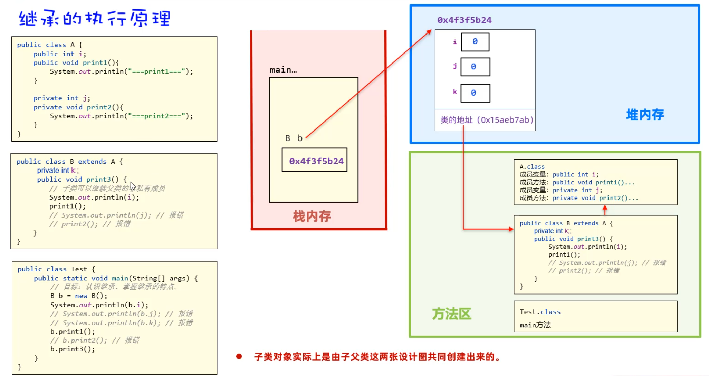

### 继承的好处

学习完继承的快速入门之后，接下来我们学习一下继承的好处，以及它的应用场景。

我们通过一个案例来学习

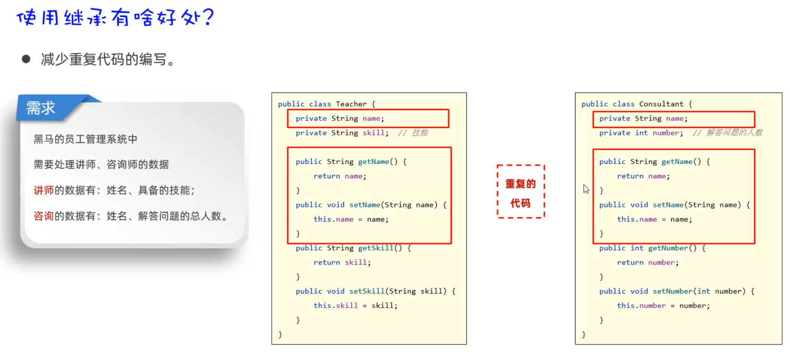

观察代码发现，我们会发现 Teacher 类中和 Consultant 类中有相同的代码；其实像这种两个类中有相同代码时，没必要重复写。

我们可以把重复的代码提取出来，作为父类，然后让其他类继承父类就可以了，这样可以提高代码的复用性。改造后的代码如下：

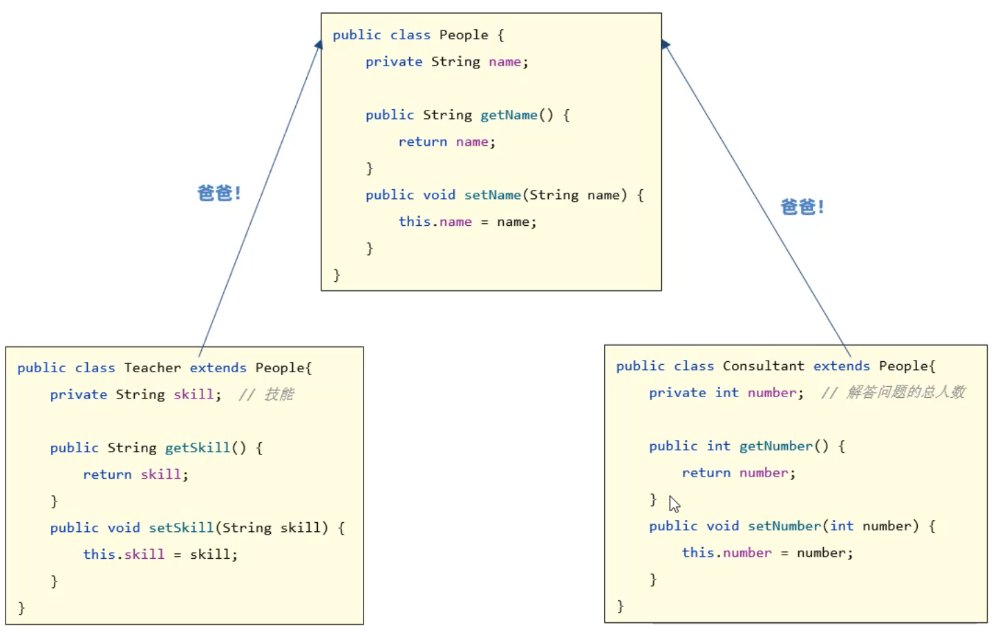

接下来使用继承来完成上面的案例，这里只演示 People 类和 Teacher 类，然后你尝试自己完成 Consultant 类。

- 先写一个父类 People，用来设计 Teacher 和 Consultant 公有的成员。

```java
public class People {
    private String name;

    public String getName() {
        return name;
    }
    public void setName(String name) {
        this.name = name;
    }
}
```

- 再写两个子类 Teacher 继承 People 类，同时在子类中加上自己特有的成员。

```java
public class Teacher extends People {
    private String skill; // 技能

    public String getSkill() {
        return skill;
    }

    public void setSkill(String skill) {
        this.skill = skill;
    }

    public void printInfo() {
        System.out.println(getName() + "具备的技能：" + skill);
    }
}
```

- 最后再写一个测试类，再测试类中创建 Teacher、Consultant 对象，并调用方法。

```java
public class Test {
    public static void main(String[] args) {
        // 目标：搞清楚继承的好处。
        Teacher t = new Teacher();
        t.setName("播仔");
        t.setSkill("Java、Spring");
        System.out.println(t.getName());
        System.out.println(t.getSkill());
        t.printInfo();
    }
}
```

执行代码，打印结果如下：

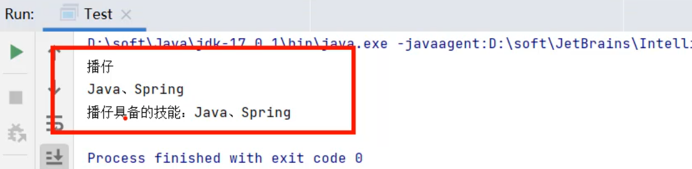

关于继承的好处我们只需要记住：**继承可以提高代码的复用性**

### 权限修饰符

在刚才使用继承编写的代码中我们有用到两个权限修饰符，一个是 public（公有的）、一个是 private（私有的），实际上还有两个权限修饰符，一个是 protected（受保护的）、一个是缺省的（不写任何修饰符）。

接下来我们就学习一下这四个权限修饰符分别有什么作用。

> **什么是权限修饰符呢？**
>
> 权限修饰符是用来限制类的成员（成员变量、成员方法、构造器...）能够被访问的范围。

每一种权限修饰符能够被访问的范围如下

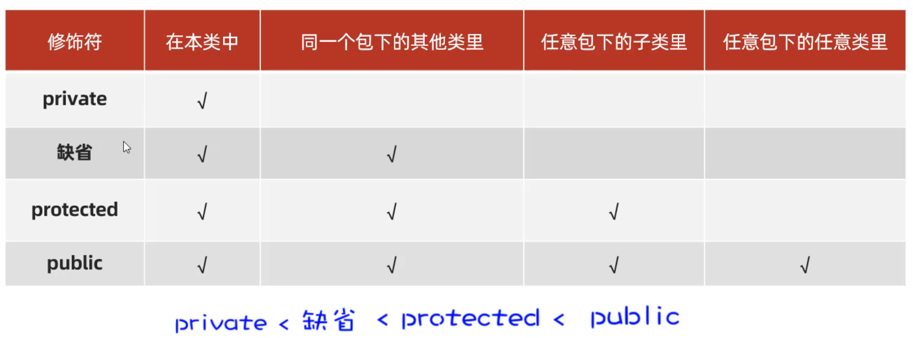

下面我们用代码演示一下，在本类中可以访问到哪些权限修饰的方法。

```java
public class Fu {
    // 1、私有:只能在本类中访问
    private void privateMethod() {
        System.out.println("==private==");
    }

    // 2、缺省：本类，同一个包下的类
    void method() {
        System.out.println("==缺省==");
    }

    // 3、protected: 本类，同一个包下的类，任意包下的子类
    protected void protectedMethod() {
        System.out.println("==protected==");
    }

    // 4、public： 本类，同一个包下的类，任意包下的子类，任意包下的任意类
    public void publicMethod() {
        System.out.println("==public==");
    }

    public void test(){
        //在本类中，所有权限都可以被访问到
        privateMethod(); //正确
        method(); //正确
        protectedMethod(); //正确
        publicMethod(); //正确
    }
}
```

接下来，在和 Fu 类同一个包下，创建一个测试类 Demo，演示同一个包下可以访问到哪些权限修饰的方法。

```java
public class Demo {
    public static void main(String[] args) {
        Fu f = new Fu();
        // f.privateMethod();	// 私有方法无法使用
        f.method();
        f.protectedMethod();
        f.publicMethod();
    }
}
```

接下来，在另一个包下创建一个 Fu 类的子类，演示不同包下的子类中可以访问哪些权限修饰的方法。

```java
public class Zi extends Fu {
    //在不同包下的子类中，只能访问到public、protected修饰的方法
    public void test(){
        // privateMethod(); // 报错
        // method(); // 报错
        protectedMethod();	//正确
        publicMethod();	//正确
    }
}
```

接下来，在和 Fu 类不同的包下，创建一个测试类 Demo2，演示一下不同包的无关类，能访问到哪些权限修饰的方法；

```java
public class Demo2 {
    public static void main(String[] args) {
        Fu f = new Fu();
        // f.privateMethod(); // 报错
        // f.method();		  //报错
        // f.protecedMethod();//报错
        f.publicMethod();	//正确

        Zi zi = new Zi();
        // zi.protectedMethod();
    }
}
```

### 单继承、Object

刚才我们写的代码中，都是一个子类继承一个父类，那么有同学问到，一个子类可以继承多个父类吗？

**Java 语言只支持单继承，不支持多继承，但是可以多层继承**。就像家族里儿子、爸爸和爷爷的关系一样：一个儿子只能有一个爸爸，不能有多个爸爸，但是爸爸也是有爸爸的。

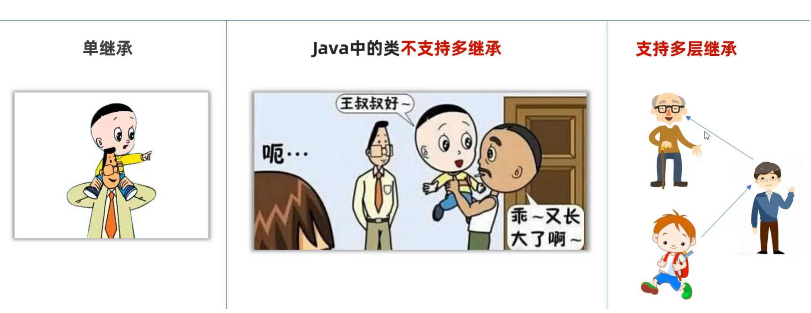

```java
public class Test {
    public static void main(String[] args) {
        // 目标：掌握继承的两个注意事项事项。
        // 1、Java是单继承的：一个类只能继承一个直接父类；
        // 2、Object类是Java中所有类的祖宗。
        A a = new A();
        B b = new B();

        ArrayList list = new ArrayList();
        list.add("java");
        System.out.println(list.toString());
    }
}

class A {} //extends Object{}
class B extends A {}
// class C extends B , A {} // 报错
class D extends B{}
```

### 方法重写

学习完继承之后，在继承的基础之上还有一个很重要的现象需要给大家说一下。

叫做方法重写。为了让大家能够掌握方法重写，我们先认识什么是方法重写，再说一下方法的应用场景。

> **什么是方法重写**

当子类觉得父类方法不好用，或者无法满足父类需求时，子类可以重写一个方法名称、参数列表一样的方法，去覆盖父类的这个方法，这就是方法重写。

**注意：重写后，方法的访问遵循就近原则**。下面我们看一个代码演示

写一个 A 类作为父类，定义两个方法 print1 和 print2

```java
public class A {
    public void print1(){
        System.out.println("111");
    }

    public void print2(int a, int b){
        System.out.println("111111");
    }
}
```

再写一个 B 类作为 A 类的子类，重写 print1 和 print2 方法。

```java
public class B extends A{
    // 方法重写
    @Override // 安全，可读性好
    public void print1() {
        System.out.println("666");
    }


    // 方法重写
    @Override
    public void print2(int a, int b) {
        System.out.println("666666");
    }
}
```

接下来，在测试类中创建 B 类对象，调用方法

```java
public class Test {
    public static void main(String[] args) {
        // 目标：认识方法重写，掌握方法重写的常见应用场景。
        B b =  new B();
        b.print1();
        b.print2(2, 3);
    }
}
```

执行代码，我们发现真正执行的是 B 类中的 print1 和 print2 方法

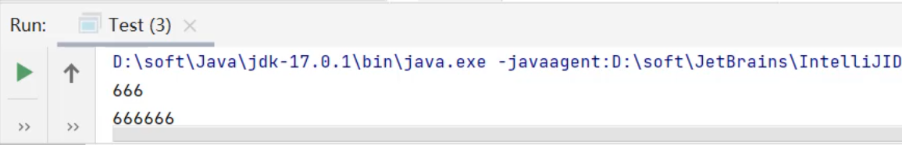

知道什么是方法重写之后，还有一些注意事项，需要和大家分享一下。

```java
- 1.重写的方法上面，可以加一个注解@Override,用于标注这个方法是复写的父类方法
- 2.子类复写父类方法时，访问权限必须大于或者等于父类方法的权限
	public > protected > 缺省
- 3. 重写的方法返回值类型，必须与被重写的方法返回值类型一样，或者范围更小
- 4. 私有方法、静态方法不能被重写，如果重写会报错。
```

关于这些注意事项，同学们其实只需要了解一下就可以了。实际上我们实际写代码时，只要和父类写的一样就可以（ 总结起来就 8 个字：**声明不变，重新实现**）

> **方法重写的应用场景**

学习完方法重写之后，接下来，我们还需要大家掌握方法重写，在实际中的应用场景。方法重写的应用场景之一就是：**子类重写 Object 的 toString()方法，以便返回对象的内容。**

比如：有一个 Student 类，这个类会默认继承 Object 类。

```java
public class Student extends Object{
    private String name;
    private int age;

    public Student() {
    }

    public Student(String name, int age) {
        this.name = name;
        this.age = age;
    }

    public String getName() {
        return name;
    }

    public void setName(String name) {
        this.name = name;
    }

    public int getAge() {
        return age;
    }

    public void setAge(int age) {
        this.age = age;
    }
}
```

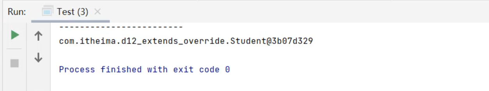

但是，此时不想调用父类 Object 的 toString()方法，那就可以在 Student 类中重新写一个 toSting()方法，用于返回对象的属性值。

```java
package com.itheima.d12_extends_override;

public class Student extends Object{
    private String name;
    private int age;

    public Student() {
    }

    public Student(String name, int age) {
        this.name = name;
        this.age = age;
    }

    public String getName() {
        return name;
    }

    public void setName(String name) {
        this.name = name;
    }

    public int getAge() {
        return age;
    }

    public void setAge(int age) {
        this.age = age;
    }

    @Override
    public String toString() {
        return "Student{" +
                "name='" + name + '\'' +
                ", age=" + age +
                '}';
    }
}
```

重新运行测试类，结果如下


好了，到这里方法什么是方法重写，以及方法重写的应用场景我们就学习完了。

### 子类中访问成员的特点

刚才我们已经学习了继承，我们发现继承至少涉及到两个类，而每一个类中都可能有各自的成员（成员变量、成员方法），就有可能出现子类和父类有相同成员的情况，那么在子类中访问其他成员有什么特点呢？

- **原则：在子类中访问其他成员（成员变量、成员方法），是依据就近原则的**

定义一个父类，代码如下

```java
public class F {
    String name = "父类名字";

    public void print1(){
        System.out.println("==父类的print1方法执行==");
    }
}
```

再定义一个子类，代码如下。有一个同名的 name 成员变量，有一个同名的 print1 成员方法；

```java
public class Z extends F {
    String name = "子类名称";
    public void showName(){
        String name = "局部名称";
        System.out.println(name); // 局部名称
    }

    @Override
    public void print1(){
        System.out.println("==子类的print1方法执行了=");
    }

    public void showMethod(){
        print1(); // 子类的
    }
}
```

接下来写一个测试类，观察运行结果，我们发现都是调用的子类变量、子类方法。

```java
public class Test {
    public static void main(String[] args) {
        // 目标：掌握子类中访问其他成员的特点：就近原则。
        Z z = new Z();
        z.showName();
        z.showMethod();
    }
}
```

- 如果子类和父类出现同名变量或者方法，优先使用子类的；此时如果一定要在子类中使用父类的成员，可以加 this 或者 super 进行区分。

```java
public class Z extends F {
    String name = "子类名称";

    public void showName(){
        String name = "局部名称";
        System.out.println(name); // 局部名称
        System.out.println(this.name); // 子类成员变量
        System.out.println(super.name); // 父类的成员变量
    }

    @Override
    public void print1(){
        System.out.println("==子类的print1方法执行了=");
    }

    public void showMethod(){
        print1(); // 子类的
        super.print1(); // 父类的
    }
}
```

### 子类中访问构造器的特点

我们知道一个类中可以写成员变量、成员方法，还有构造器。在继承关系下，子类访问成员变量和成员方法的特点我们已经学过了；接下来再学习子类中访问构造器的特点。

我们先认识子类构造器的语法特点，再讲一下子类构造器的应用场景

> **子类中访问构造器的语法规则**

- 首先，子类全部构造器，都会先调用父类构造器，再执行自己。

  执行顺序，如下图按照 ① ② ③ 步骤执行：

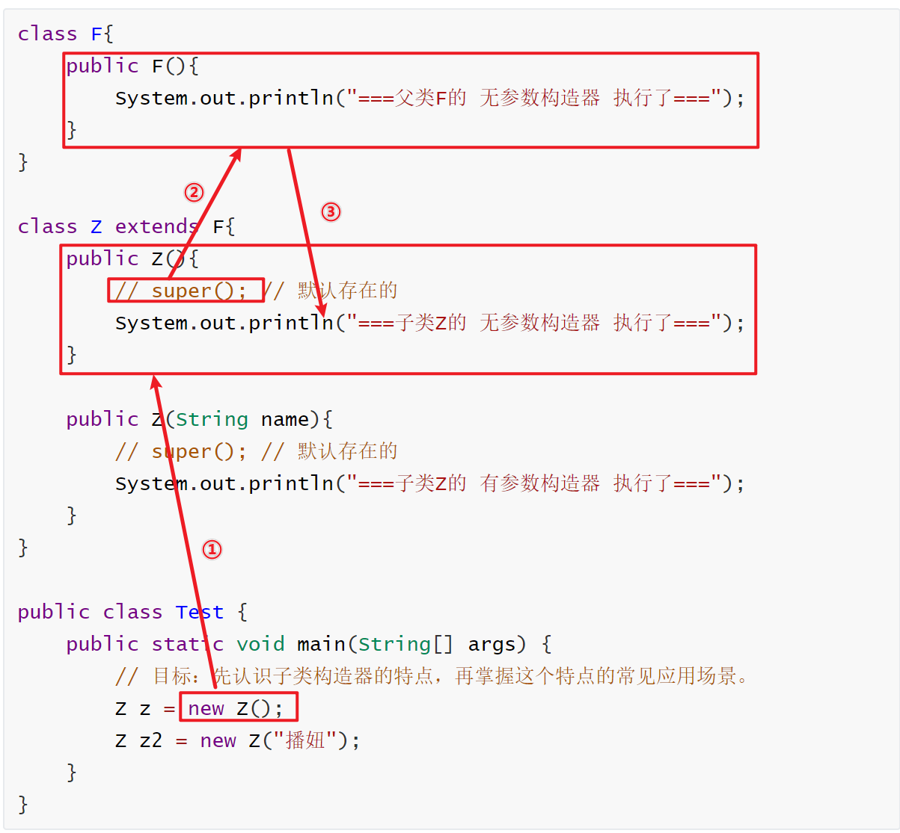

> **子类访问构造器的应用场景**

- 如果不想使用默认的`super()`方式调用父类构造器，还可以手动使用`super(参数)`调用父类有参数构造器。

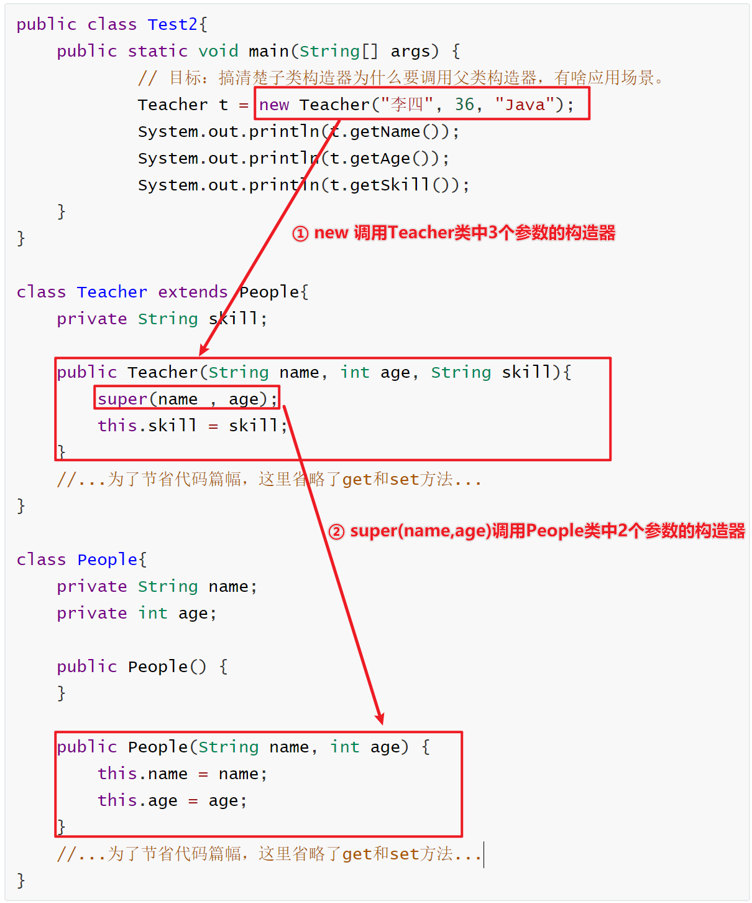

> **在本类中访问自己的构造方法**

刚才我们学习了通过`super()`和`super(参数)`可以访问父类的构造器。有时候我们也需要访问自己类的构造器。语法如下

```java
this(): 调用本类的空参数构造器
this(参数): 调用本类有参数的构造器
```

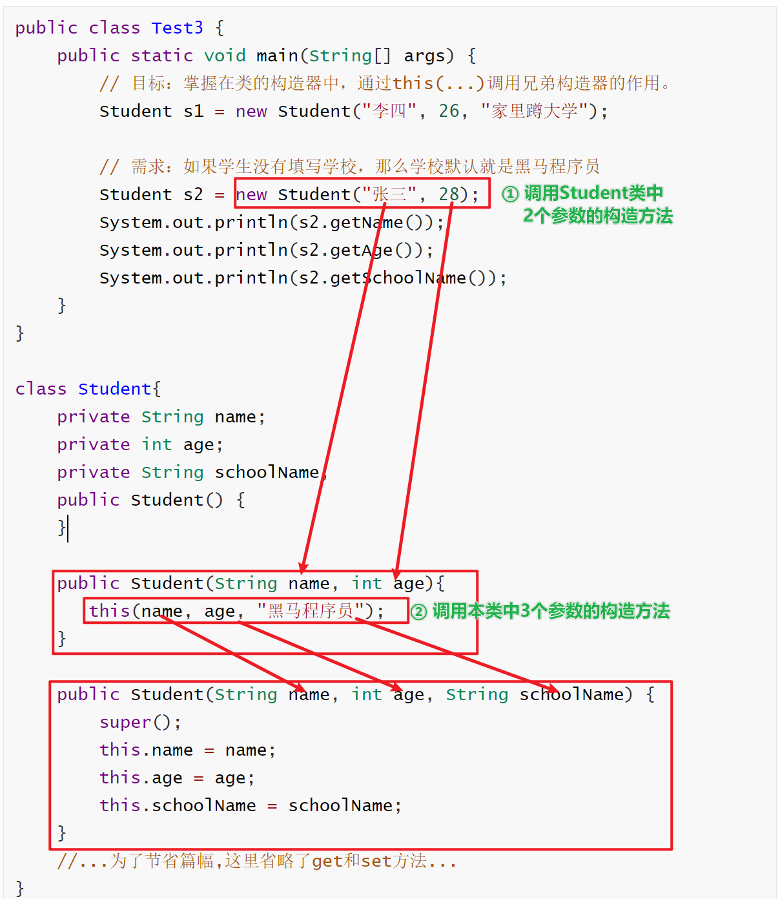

> **最后我们被 this 和 super 的用法在总结一下**

```java
访问本类成员：
	this.成员变量	//访问本类成员变量
	this.成员方法	//调用本类成员方法
	this()		   //调用本类空参数构造器
    this(参数)	  //调用本类有参数构造器

访问父类成员：
	super.成员变量	//访问父类成员变量
	super.成员方法	//调用父类成员方法
	super()		   //调用父类空参数构造器
    super(参数)	  //调用父类有参数构造器

注意：this和super访问构造方法，只能用到构造方法的第一句，否则会报错。
```
