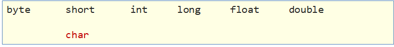

# Java 基础语法

## 介绍

#### 注释（理解）

注释是对代码的解释和说明文字，可以提高程序的可读性，因此在程序中添加必要的注释文字十分重要。Java 中的注释分为三种：

单行注释。单行注释的格式是使用//，从//开始至本行结尾的文字将作为注释文字。

```java
// 这是单行注释文字
```

多行注释。多行注释的格式是使用/_ 和 _/将一段较长的注释括起来。

```java
/*
这是多行注释文字
这是多行注释文字
这是多行注释文字
*/
注意：多行注释不能嵌套使用。
```

文档注释。文档注释以`/**`开始，以`*/`结束。（以后讲）

#### 字面量（应用）

作用：告诉程序员，数据在程序中的书写格式。

| **字面量类型** | **说明**                                  | **程序中的写法**            |
| -------------- | ----------------------------------------- | --------------------------- |
| 整数           | 不带小数的数字                            | 666，-88                    |
| 小数           | 带小数的数字                              | 13.14，-5.21                |
| 字符           | 必须使用单引号，有且仅能一个字符          | ‘A’，‘0’， ‘我’             |
| 字符串         | 必须使用双引号，内容可有可无              | “HelloWorld”，“Java 程序员” |
| 布尔值         | 布尔值，表示真假，只有两个值：true，false | true 、false                |
| 空值           | 一个特殊的值，空值                        | 值是：null                  |

```java
public class Demo {
    public static void main(String[] args) {
        System.out.println(10); // 输出一个整数
        System.out.println(5.5); // 输出一个小数
        System.out.println('a'); // 输出一个字符
        System.out.println(true); // 输出boolean值true
        System.out.println("欢迎来到"); // 输出字符串
    }
}
```

#### 数据类型（记忆、应用）

##### 计算机存储单元

l 计算机底层都是一些数字电路(理解成开关)，用开表示 0、关表示 1，这些 01 的形式就是二进制。

数据在计算机底层都是采用二进制存储的，l 在计算机中认为一个开关表示的 0|1 称为 1 位（b），每 8 位称为一个字节（B）， 所以 1B=8b

字节是计算机中数据的最小单位。

我们知道计算机是可以用来存储数据的，但是无论是内存还是硬盘，计算机存储设备的最小信息单元叫“位（bit）”，我们又称之为“比特位”，通常用小写的字母”b”表示。而计算机中最基本的存储单元叫“字节（byte）”，

通常用大写字母”B”表示，字节是由连续的 8 个位组成。

除了字节外还有一些常用的存储单位，其换算单位如下：
1B（字节） = 8bit

1KB = 1024B

1MB = 1024KB

1GB = 1024MB

1TB = 1024GB

##### Java 中的数据类型

Java 是一个强类型语言，Java 中的数据必须明确数据类型。在 Java 中的数据类型包括基本数据类型和引用数据类型两种。

Java 中的基本数据类型：
| 数据类型 | 关键字 | 内存占用（字节） | 取值范围 |
|:----:|:-------:|:----:|:---------------------------------:|
| 整数 | byte | 1 | 负的 2 的 7 次方 ~ 2 的 7 次方-1(-128~127) |
| | short | 2 | 负的 2 的 15 次方 ~ 2 的 15 次方-1(-32768~32767) |
| | int | 4 | 负的 2 的 31 次方 ~ 2 的 31 次方-1 |
| | long | 8 | 负的 2 的 63 次方 ~ 2 的 63 次方-1 |
| 浮点数 | float | 4 | 1.401298e-45 ~ 3.402823e+38 |
| | double | 8 | 4.9000000e-324 ~ 1.797693e+308 |
| 字符 | char | 2 | 0-65535 |
| 布尔 | boolean | 1 | true，false |
说明：

​ e+38 表示是乘以 10 的 38 次方，同样，e-45 表示乘以 10 的负 45 次方。

​ 在 java 中整数默认是 int 类型，浮点数默认是 double 类型。

#### 变量（应用）

##### 变量的定义

变量：在程序运行过程中，其值可以发生改变的量。

从本质上讲，变量是内存中的一小块区域，其值可以在一定范围内变化。

变量的定义格式：

```java
数据类型 变量名 = 初始化值; // 声明变量并赋值
int age = 18;
System.out.println(age);
```

或者

```java
// 先声明，后赋值（使用前赋值即可）
数据类型 变量名;
变量名 = 初始化值;
double money;
money = 55.5;
System.out.println(money);
```

还可以在同一行定义多个同一种数据类型的变量，中间使用逗号隔开。但不建议使用这种方式，降低程序的可读性。

```java
int a = 10, b = 20; // 定义int类型的变量a和b，中间使用逗号隔开
System.out.println(a);
System.out.println(b);

int c,d; // 声明int类型的变量c和d，中间使用逗号隔开
c = 30;
d = 40;
System.out.println(c);
System.out.println(d);
```

变量的使用：通过变量名访问即可。

##### 使用变量时的注意事项

1. 在同一对花括号中，变量名不能重复。
2. 变量在使用之前，必须初始化（赋值）。
3. 定义 long 类型的变量时，需要在整数的后面加 L（大小写均可，建议大写）。因为整数默认是 int 类型，整数太大可能超出 int 范围。
4. 定义 float 类型的变量时，需要在小数的后面加 F（大小写均可，建议大写）。因为浮点数的默认类型是 double， double 的取值范围是大于 float 的，类型不兼容。

#### 关键字、标志符（记忆、理解）

**关键字**

Java 自己保留的一些单词，作为特殊功能的，例如：public、class、byte、short、int、long、double…

我们不能用来作为类名或者是变量名称，否则报错。

注意：关键字很多，不用刻意去记。

| **abstract**   | **assert**       | **boolean**   | **break**      | **byte**   |
| -------------- | ---------------- | ------------- | -------------- | ---------- |
| **case**       | **catch**        | **char**      | **class**      | **const**  |
| **continue**   | **default**      | **do**        | **double**     | **else**   |
| **enum**       | **extends**      | **final**     | **finally**    | **float**  |
| **for**        | **goto**         | **if**        | **implements** | **import** |
| **instanceof** | **int**          | **interface** | **long**       | **native** |
| **new**        | **package**      | **private**   | **protected**  | **public** |
| **return**     | **strictfp**     | **short**     | **static**     | **super**  |
| **switch**     | **synchronized** | **this**      | **throw**      | **throws** |
| **transient**  | **try**          | **void**      | **volatile**   | **while**  |

**标志符**

标志符就是由一些字符、符号组合起来的名称，用于给类，方法，变量等起名字的规矩。

基本要求：由数字、字母、下划线(\_)和美元符($)等组成

强制要求：不能以数字开头、不能是关键字、区分大小写

**基本命令规范**


变量名称：满足标识符规则，建议全英文、有意义、首字母小写，满足“驼峰模式”，例如：int studyNumber = 59。

类名称： 满足标识符规则，建议全英文、有意义、首字母大写，满足“驼峰模式”，例如：HelloWorld.java。

## 类型转换问题

#### 类型转换（理解）

在 Java 中，会存在不同类型的数据需要一起参与运算，所以这些数据类型之间是需要相互转换的，分为两种情况：自动类型转换和强制类型转换。

#### 自动类型转换

类型范围小**的变量，可以**直接赋值**给**类型范围大的变量。


把一个表示数据范围小的数值或者变量赋值给另一个表示数据范围大的变量。这种转换方式是自动的，直接书写即可。例如：

```java
double num = 10; // 将int类型的10直接赋值给double类型
System.out.println(num); // 输出10.0

byte a = 12 ;
int b = a;
System.out.println(b); // 12

```

#### **表达式的自动类型转换**

在表达式中，小范围类型的变量会自动转换成当前较大范围的类型再运算。


**注意事项：**

表达式的最终结果类型由表达式中的最高类型决定。

在表达式中，byte、short、char 是直接转换成 int 类型参与运算的。

#### 强制类型转换

类型范围大的数据或者变量，不能直接**赋值**给**类型范围小**的变量，会报错，把一个表示数据范围大的数值或者变量赋值给另一个表示数据范围小的变量必须进行强制类型转换。

强制类型转换格式：目标数据类型 变量名 = (目标数据类型)值或者变量;

​ 例如：

```java
double num1 = 5.5;
int num2 = (int) num1; // 将double类型的num1强制转换为int类型
System.out.println(num2); // 输出5（小数位直接舍弃）
```

说明：

1. char 类型的数据转换为 int 类型是按照码表中对应的 int 值进行计算的。比如在 ASCII 码表中，'a'对应 97。

```java
int a = 'a';
System.out.println(a); // 将输出97
```

2. 整数默认是 int 类型，byte、short 和 char 类型数据参与运算均会自动转换为 int 类型。

```java
byte b1 = 10;
byte b2 = 20;
byte b3 = b1 + b2;
// 第三行代码会报错，b1和b2会自动转换为int类型，计算结果为int，int赋值给byte需要强制类型转换。
// 修改为:
int num = b1 + b2;
// 或者：
byte b3 = (byte) (b1 + b2);
```

3. boolean 类型不能与其他基本数据类型相互转换。

## 运算符

### 算术运算符（理解）

#### 运算符和表达式

运算符：对常量或者变量进行操作的符号

表达式：用运算符把常量或者变量连接起来符合 java 语法的式子就可以称为表达式。

不同运算符连接的表达式体现的是不同类型的表达式。

举例说明：

```java
int a = 10;
int b = 20;
int c = a + b;
```

+：是运算符，并且是算术运算符。

a + b：是表达式，由于+是算术运算符，所以这个表达式叫算术表达式。

#### 算术运算符

| 符号 | 作用 | 说明                         |
| ---- | ---- | ---------------------------- |
| +    | 加   | 参看小学一年级               |
| -    | 减   | 参看小学一年级               |
| \*   | 乘   | 参看小学二年级，与“×”相同    |
| /    | 除   | 参看小学二年级，与“÷”相同    |
| %    | 取余 | 获取的是两个数据做除法的余数 |

注意：

/和%的区别：两个数据做除法，/取结果的商，%取结果的余数。

整数操作只能得到整数，要想得到小数，必须有浮点数参与运算。

```java
int a = 10;
int b = 3;
System.out.println(a / b); // 输出结果3
System.out.println(a % b); // 输出结果1
```

#### 字符的“+”操作

char 类型参与算术运算，使用的是计算机底层对应的十进制数值。需要我们记住三个字符对应的数值：

'a' -- 97 a-z 是连续的，所以'b'对应的数值是 98，'c'是 99，依次递加

'A' -- 65 A-Z 是连续的，所以'B'对应的数值是 66，'C'是 67，依次递加

'0' -- 48 0-9 是连续的，所以'1'对应的数值是 49，'2'是 50，依次递加

```java
// 可以通过使用字符与整数做算术运算，得出字符对应的数值是多少
char ch1 = 'a';
System.out.println(ch1 + 1); // 输出98，97 + 1 = 98

char ch2 = 'A';
System.out.println(ch2 + 1); // 输出66，65 + 1 = 66

char ch3 = '0';
System.out.println(ch3 + 1); // 输出49，48 + 1 = 49
```

算术表达式中包含不同的基本数据类型的值的时候，整个算术表达式的类型会自动进行提升。

提升规则：

byte 类型，short 类型和 char 类型将被提升到 int 类型，不管是否有其他类型参与运算。

整个表达式的类型自动提升到与表达式中最高等级的操作数相同的类型

​ 等级顺序：byte,short,char --> int --> long --> float --> double

例如：

```java
byte b1 = 10;
byte b2 = 20;
// byte b3 = b1 + b2; // 该行报错，因为byte类型参与算术运算会自动提示为int，int赋值给byte可能损失精度
int i3 = b1 + b2; // 应该使用int接收
byte b3 = (byte) (b1 + b2); // 或者将结果强制转换为byte类型
-------------------------------
int num1 = 10;
double num2 = 20.0;
double num3 = num1 + num2; // 使用double接收，因为num1会自动提升为double类型
```

tips：正是由于上述原因，所以在程序开发中我们很少使用 byte 或者 short 类型定义整数。也很少会使用 char 类型定义字符，而使用字符串类型，更不会使用 char 类型做算术运算。

#### 字符串的“+”操作

当“+”操作中出现字符串时，这个”+”是字符串连接符，而不是算术运算。

```java
System.out.println("hello"+ 666); // 输出：hello666
```

在”+”操作中，如果出现了字符串，就是连接运算符，否则就是算术运算。当连续进行“+”操作时，从左到右逐个执行。

```java
System.out.println(1 + 99 + "年秀儿"); // 输出：199年秀儿
System.out.println(1 + 2 + "hello" + 3 + 4); // 输出：3hello34
// 可以使用小括号改变运算的优先级
System.out.println(1 + 2 + "hello" + (3 + 4)); // 输出：3hello7
```

### 赋值运算符（应用）

赋值运算符的作用是将一个表达式的值赋给左边，左边必须是可修改的，不能是常量。

| 符号 | 作用       | 说明                     |
| ---- | ---------- | ------------------------ |
| =    | 赋值       | a=10，将 10 赋值给变量 a |
| +=   | 加后赋值   | a+=b，将 a+b 的值给 a    |
| -=   | 减后赋值   | a-=b，将 a-b 的值给 a    |
| \*=  | 乘后赋值   | a\*=b，将 a×b 的值给 a   |
| /=   | 除后赋值   | a/=b，将 a÷b 的商给 a    |
| %=   | 取余后赋值 | a%=b，将 a÷b 的余数给 a  |

注意：

扩展的赋值运算符隐含了强制类型转换。

```java
short s = 10;
s = s + 10; // 此行代码报出，因为运算中s提升为int类型，运算结果int赋值给short可能损失精度

s += 10; // 此行代码没有问题，隐含了强制类型转换，相当于 s = (short) (s + 10);
```

### 自增自减运算符（理解）

| 符号 | 作用 | 说明         |
| ---- | ---- | ------------ |
| ++   | 自增 | 变量的值加 1 |
| --   | 自减 | 变量的值减 1 |

注意事项：

​ ++和-- 既可以放在变量的后边，也可以放在变量的前边。

​ 单独使用的时候， ++和-- 无论是放在变量的前边还是后边，结果是一样的。

​ 参与操作的时候，如果放在变量的后边，先拿变量参与操作，后拿变量做++或者--。

​ 参与操作的时候，如果放在变量的前边，先拿变量做++或者--，后拿变量参与操作。

​ 最常见的用法：单独使用。

```java
int i = 10;
i++; // 单独使用
System.out.println("i:" + i); // i:11

int j = 10;
++j; // 单独使用
System.out.println("j:" + j); // j:11

int x = 10;
int y = x++; // 赋值运算，++在后边，所以是使用x原来的值赋值给y，x本身自增1
System.out.println("x:" + x + ", y:" + y); // x:11，y:10

int m = 10;
int n = ++m; // 赋值运算，++在前边，所以是使用m自增后的值赋值给n，m本身自增1
System.out.println("m:" + m + ", m:" + m); // m:11，m:11
```

练习：

```java
int x = 10;
int y = x++ + x++ + x++;
System.out.println(y); // y的值是多少？
/*
解析，三个表达式都是++在后，所以每次使用的都是自增前的值，但程序自左至右执行，所以第一次自增时，使用的是10进行计算，但第二次自增时，x的值已经自增到11了，所以第二次使用的是11，然后再次自增。。。
所以整个式子应该是：int y = 10 + 11 + 12;
输出结果为33。
*/
注意：通过此练习深刻理解自增和自减的规律，但实际开发中强烈建议不要写这样的代码！小心挨打！
```

### 关系运算符（应用）

关系运算符有 6 种关系，分别为小于、小于等于、大于、等于、大于等于、不等于。

| 符号 | 说明                                                          |
| ---- | ------------------------------------------------------------- |
| ==   | a==b，判断 a 和 b 的值是否相等，成立为 true，不成立为 false   |
| !=   | a!=b，判断 a 和 b 的值是否不相等，成立为 true，不成立为 false |
| >    | a>b，判断 a 是否大于 b，成立为 true，不成立为 false           |
| >=   | a>=b，判断 a 是否大于等于 b，成立为 true，不成立为 false      |
| <    | a<b，判断 a 是否小于 b，成立为 true，不成立为 false           |
| <=   | a<=b，判断 a 是否小于等于 b，成立为 true，不成立为 false      |

注意事项：

​ 关系运算符的结果都是 boolean 类型，要么是 true，要么是 false。

​ 千万不要把“==”误写成“=”，"=="是判断是否相等的关系，"="是赋值。

```java
int a = 10;
int b = 20;
System.out.println(a == b); // false
System.out.println(a != b); // true
System.out.println(a > b); // false
System.out.println(a >= b); // false
System.out.println(a < b); // true
System.out.println(a <= b); // true

// 关系运算的结果肯定是boolean类型，所以也可以将运算结果赋值给boolean类型的变量
boolean flag = a > b;
System.out.println(flag); // 输出false
```

### 逻辑运算符（应用）

逻辑运算符把各个运算的关系表达式连接起来组成一个复杂的逻辑表达式，以判断程序中的表达式是否成立，判断的结果是 true 或 false。

| 符号 | 作用     | 说明                                               |
| ---- | -------- | -------------------------------------------------- |
| &    | 逻辑与   | a&b，a 和 b 都是 true，结果为 true，否则为 false   |
| \|   | 逻辑或   | a\|b，a 和 b 都是 false，结果为 false，否则为 true |
| ^    | 逻辑异或 | a^b，a 和 b 结果不同为 true，相同为 false          |
| !    | 逻辑非   | !a，结果和 a 的结果正好相反                        |
