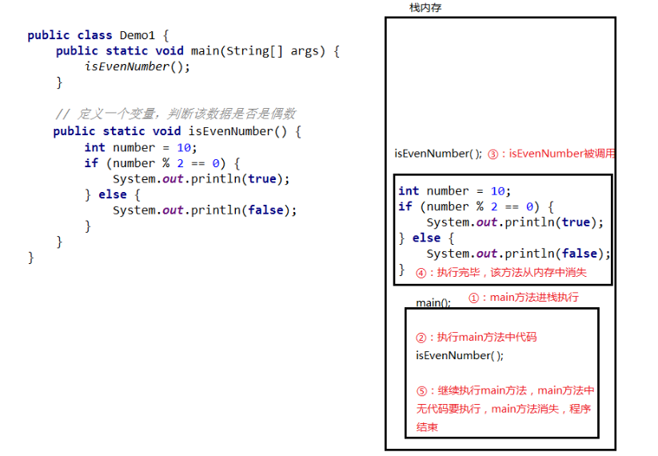

# 方法

## 方法概述

​ 方法（method）是将具有独立功能的代码块组织成为一个整体，使其具有特殊功能的代码集

- 注意：
  - 方法必须先创建才可以使用，该过程成为方法定义
  - 方法创建后并不是直接可以运行的，需要手动使用后，才执行，该过程成为方法调用

## 方法的定义和调用

### 无参数方法定义和调用（掌握）

- 定义格式：

  ```java
  public static void 方法名 (   ) {
  	// 方法体;
  }
  ```

* 范例：

  ```java
  public static void method (    ) {
  	// 方法体;
  }
  ```

* 调用格式：

  ```java
  方法名();
  ```

* 范例：

  ```java
  method();
  ```

* 注意：

  ​ 方法必须先定义，后调用，否则程序将报错

### 方法调用过程图解（理解）

- 总结：每个方法在被调用执行的时候，都会进入栈内存，并且拥有自己独立的内存空间，方法内部代码调用完毕之后，会从栈内存中弹栈消失。
  

### 无参数方法的练习（应用）

- 需求：设计一个方法用于打印两个数中的较大数
- 思路：
  - ① 定义一个方法，用于打印两个数字中的较大数，例如 getMax()
  - ② 方法中定义两个变量，用于保存两个数字
  - ③ 使用分支语句分两种情况对两个数字的大小关系进行处理
  - ④ 在 main()方法中调用定义好的方法
- 代码：

```java
public class MethodTest {
    public static void main(String[] args) {
        //在main()方法中调用定义好的方法
        getMax();
    }

    //定义一个方法，用于打印两个数字中的较大数，例如getMax()
    public static void getMax() {
        //方法中定义两个变量，用于保存两个数字
        int a = 10;
        int b = 20;

        //使用分支语句分两种情况对两个数字的大小关系进行处理
        if(a > b) {
            System.out.println(a);
        } else {
            System.out.println(b);
        }
    }
}
```

## 带参数方法定义和调用

### 带参数方法定义和调用（掌握）

- 定义格式：

  参数：由数据类型和变量名组成 - 数据类型 变量名

  参数范例：int a

  ```java
  public static void 方法名 (参数1) {
  	方法体;
  }

  public static void 方法名 (参数1, 参数2, 参数3...) {
  	方法体;
  }
  ```

* 范例：

  ```java
  public static void isEvenNumber(int number){
      ...
  }
  public static void getMax(int num1, int num2){
      ...
  }
  ```

  - 注意：

    方法定义时，参数中的数据类型与变量名都不能缺少，缺少任意一个程序将报错

    方法定义时，多个参数之间使用逗号( ，)分隔

* 调用格式：

  ```java
  方法名(参数)；

  方法名(参数1,参数2);
  ```

* 范例：

  ```java
  isEvenNumber(10);

  getMax(10,20);
  ```

  - 方法调用时，参数的数量与类型必须与方法定义中的设置相匹配，否则程序将报错

### 形参和实参（理解）

1. 形参：方法定义中的参数

​ 等同于变量定义格式，例如：int number

2. 实参：方法调用中的参数

​ 等同于使用变量或常量，例如： 10 number

### 带参数方法练习（应用）

- 需求：设计一个方法用于打印两个数中的较大数，数据来自于方法参数 }
- 思路：
  - ① 定义一个方法，用于打印两个数字中的较大数，例如 getMax()
  - ② 为方法定义两个参数，用于接收两个数字
  - ③ 使用分支语句分两种情况对两个数字的大小关系进行处理
  - ④ 在 main()方法中调用定义好的方法（使用常量）
  - ⑤ 在 main()方法中调用定义好的方法（使用变量）
- 代码：

```java
public class MethodTest {
    public static void main(String[] args) {
        //在main()方法中调用定义好的方法（使用常量）
        getMax(10,20);
        //调用方法的时候，人家要几个，你就给几个，人家要什么类型的，你就给什么类型的
        //getMax(30);
        //getMax(10.0,20.0);

        //在main()方法中调用定义好的方法（使用变量）
        int a = 10;
        int b = 20;
        getMax(a, b);
    }

    //定义一个方法，用于打印两个数字中的较大数，例如getMax()
    //为方法定义两个参数，用于接收两个数字
    public static void getMax(int a, int b) {
        //使用分支语句分两种情况对两个数字的大小关系进行处理
        if(a > b) {
            System.out.println(a);
        } else {
            System.out.println(b);
        }
    }
}
```

## 带返回值方法的定义和调用

### 带返回值方法定义和调用（掌握）

- 定义格式

  ```java
  public static 数据类型 方法名 ( 参数 ) {
  	return 数据 ;
  }
  ```

* 范例

  ```java
  public static boolean isEvenNumber( int number ) {
  	return true ;
  }
  public static int getMax( int a, int b ) {
  	return  100 ;
  }
  ```

  - 注意：
    - 方法定义时 return 后面的返回值与方法定义上的数据类型要匹配，否则程序将报错

* 调用格式

  ```java
  方法名 ( 参数 ) ;
  数据类型 变量名 = 方法名 ( 参数 ) ;
  ```

* 范例

  ```java
  isEvenNumber(5) ;
  boolean flag = isEvenNumber(5);
  ```

  - 注意：
    - 方法的返回值通常会使用变量接收，否则该返回值将无意义

### 带返回值方法练习（应用）

- 需求：设计一个方法可以获取两个数的较大值，数据来自于参数

- 思路：

  - ① 定义一个方法，用于获取两个数字中的较大数
  - ② 使用分支语句分两种情况对两个数字的大小关系进行处理
  - ③ 根据题设分别设置两种情况下对应的返回结果
  - ④ 在 main()方法中调用定义好的方法并使用变量保存
  - ⑤ 在 main()方法中调用定义好的方法并直接打印结果

* 代码：

  ```java
  public class MethodTest {
      public static void main(String[] args) {
          //在main()方法中调用定义好的方法并使用变量保存
          int result = getMax(10,20);
          System.out.println(result);

          //在main()方法中调用定义好的方法并直接打印结果
          System.out.println(getMax(10,20));
      }

      //定义一个方法，用于获取两个数字中的较大数
      public static int getMax(int a, int b) {
          //使用分支语句分两种情况对两个数字的大小关系进行处理
          //根据题设分别设置两种情况下对应的返回结果
          if(a > b) {
              return a;
          } else {
              return b;
          }
      }
  }
  ```

## 方法的注意事项

### 方法的注意事项（掌握）

- 方法不能嵌套定义

  - 示例代码：

    ```java
    public class MethodDemo {
      public static void main(String[] args) {

      }

      public static void methodOne() {
        public static void methodTwo() {
          // 这里会引发编译错误!!!
        }
      }
    }
    ```

* void 表示无返回值，可以省略 return，也可以单独的书写 return，后面不加数据

  - 示例代码：

    ```java
    public class MethodDemo {
        public static void main(String[] args) {

        }
        public static void methodTwo() {
            //return 100; 编译错误，因为没有具体返回值类型
            return;
            //System.out.println(100); return语句后面不能跟数据或代码
        }
    }
    ```

### 方法的通用格式（掌握）

- 格式：

  ```java
  public static 返回值类型 方法名(参数) {
     方法体;
     return 数据 ;
  }
  ```

* 解释：

  - public static 修饰符，目前先记住这个格式

    返回值类型 方法操作完毕之后返回的数据的数据类型

    ​ 如果方法操作完毕，没有数据返回，这里写 void，而且方法体中一般不写 return

    方法名 调用方法时候使用的标识

    参数 由数据类型和变量名组成，多个参数之间用逗号隔开

    方法体 完成功能的代码块

    return 如果方法操作完毕，有数据返回，用于把数据返回给调用者

* 定义方法时，要做到两个明确

  - 明确返回值类型：主要是明确方法操作完毕之后是否有数据返回，如果没有，写 void；如果有，写对应的数据类型
  - 明确参数：主要是明确参数的类型和数量

* 调用方法时的注意：

  - void 类型的方法，直接调用即可
  - 非 void 类型的方法，推荐用变量接收调用

## 方法重载

### 方法重载（理解）

- 方法重载概念

  方法重载指同一个类中定义的多个方法之间的关系，满足下列条件的多个方法相互构成重载

  - 多个方法在同一个类中
  - 多个方法具有相同的方法名
  - 多个方法的参数不相同，类型不同或者数量不同

- 注意：

  - 重载仅对应方法的定义，与方法的调用无关，调用方式参照标准格式
  - 重载仅针对同一个类中方法的名称与参数进行识别，与返回值无关，换句话说不能通过返回值来判定两个方法是否相互构成重载

* 正确范例：

  ```java
  public class MethodDemo {
  	public static void fn(int a) {
      	//方法体
      }
      public static int fn(double a) {
      	//方法体
      }
  }

  public class MethodDemo {
  	public static float fn(int a) {
      	//方法体
      }
      public static int fn(int a , int b) {
      	//方法体
      }
  }
  ```

* 错误范例：

  ```java
  public class MethodDemo {
  	public static void fn(int a) {
      	//方法体
      }
      public static int fn(int a) { 	/*错误原因：重载与返回值无关*/
      	//方法体
      }
  }

  public class MethodDemo01 {
      public static void fn(int a) {
          //方法体
      }
  }
  public class MethodDemo02 {
      public static int fn(double a) { /*错误原因：这是两个类的两个fn方法*/
          //方法体
      }
  }
  ```
