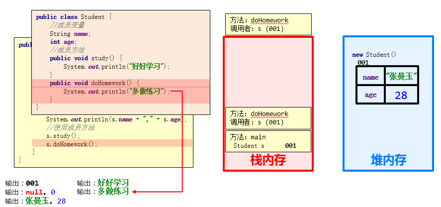

# 面对对象

## 类和对象

客观存在的事物皆为对象 ，所以我们也常常说万物皆对象。

- 类
  - 类的理解
    - 类是对现实生活中一类具有共同属性和行为的事物的抽象
    - 类是对象的数据类型，类是具有相同属性和行为的一组对象的集合
    - 简单理解：类就是对现实事物的一种描述
  - 类的组成
    - 属性：指事物的特征，例如：手机事物（品牌，价格，尺寸）
    - 行为：指事物能执行的操作，例如：手机事物（打电话，发短信）
- 类和对象的关系
  - 类：类是对现实生活中一类具有共同属性和行为的事物的抽象
  - 对象：是能够看得到摸的着的真实存在的实体
  - 简单理解：**类是对事物的一种描述，对象则为具体存在的事物**

### 类的定义

类的组成是由属性和行为两部分组成

- 属性：在类中通过成员变量来体现（类中方法外的变量）
- 行为：在类中通过成员方法来体现（和前面的方法相比去掉 static 关键字即可）

类的定义步骤：

① 定义类

② 编写类的成员变量

③ 编写类的成员方法

```java
public class 类名 {
    // 成员变量
    变量1的数据类型 变量1；
    变量2的数据类型 变量2;
    …
    // 成员方法
    方法1;
    方法2;
}
```

示例代码：

```java
/*
  手机类：
    类名：
    手机(Phone)

    成员变量：
    品牌(brand)
    价格(price)

    成员方法：
    打电话(call)
    发短信(sendMessage)
 */
public class Phone {
    //成员变量
    String brand;
    int price;

    //成员方法
    public void call() {
        System.out.println("打电话");
    }

    public void sendMessage() {
        System.out.println("发短信");
    }
}
```

### 对象的使用

- 创建对象的格式：
  - 类名 对象名 = new 类名();
- 调用成员的格式：
  - 对象名.成员变量
  - 对象名.成员方法();
- 示例代码

```java
/*
  创建对象
    格式：类名 对象名 = new 类名();
    范例：Phone p = new Phone();

  使用对象
    1：使用成员变量
        格式：对象名.变量名
        范例：p.brand
    2：使用成员方法
        格式：对象名.方法名()
        范例：p.call()
 */
public class PhoneDemo {
    public static void main(String[] args) {
        //创建对象
        Phone p = new Phone(); // new出内容在堆内存，有默认值

        //使用成员变量
        System.out.println(p.brand); // null
        System.out.println(p.price); // 0

        p.brand = "小米";
        p.price = 2999;

        System.out.println(p.brand);
        System.out.println(p.price);

        //使用成员方法
        p.call();
        p.sendMessage();
    }
}
```

### 学生对象-练习

- 需求：首先定义一个学生类，然后定义一个学生测试类，在学生测试类中通过对象完成成员变量和成员方法的使用
- 分析：
  - 成员变量：姓名，年龄…
  - 成员方法：学习，做作业…
- 示例代码：

```java
class Student {
    //成员变量
    String name;
    int age;

    //成员方法
    public void study() {
        System.out.println("好好学习，天天向上");
    }

    public void doHomework() {
        System.out.println("键盘敲烂，头发掉光");
    }
}
/*
    学生测试类
 */
public class StudentDemo {
    public static void main(String[] args) {
        //创建对象
        Student s = new Student();

        //使用对象
        System.out.println(s.name + "," + s.age);

        s.name = "林青霞";
        s.age = 30;

        System.out.println(s.name + "," + s.age);

        s.study();
        s.doHomework();
    }
}
```

## 对象内存图

### 单个对象内存图

- 成员变量使用过程


- 成员方法调用过程



### 多个对象内存图

- 成员变量使用过程


- 成员方法调用过程


- 总结：

  多个对象在堆内存中，都有不同的内存划分，成员变量存储在各自的内存区域中，成员方法多个对象共用的一份

### 2.3 多个对象指向相同内存图


- 总结

  当多个对象的引用指向同一个内存空间（变量所记录的地址值是一样的）

  只要有任何一个对象修改了内存中的数据，随后，无论使用哪一个对象进行数据获取，都是修改后的数据。

## 成员变量和局部变量

### 成员变量和局部变量的区别

- 类中位置不同：成员变量（类中方法外）局部变量（方法内部或方法声明上）
- 内存中位置不同：成员变量（堆内存）局部变量（栈内存）
- 生命周期不同：成员变量（随着对象的存在而存在，随着对象的消失而消失）局部变量（随着方法的调用而存在，醉着方法的调用完毕而消失）
- 初始化值不同：成员变量（有默认初始化值）局部变量（没有默认初始化值，必须先定义，赋值才能使用）

## 封装

### private 关键字

private 是一个修饰符，可以用来修饰成员（成员变量，成员方法）

- 被 private 修饰的成员，只能在本类进行访问，针对 private 修饰的成员变量，如果需要被其他类使用，提供相应的操作

  - 提供“get 变量名()”方法，用于获取成员变量的值，方法用 public 修饰
  - 提供“set 变量名(参数)”方法，用于设置成员变量的值，方法用 public 修饰

* 示例代码：

  ```java
  /*
      学生类
   */
  class Student {
      //成员变量
      String name;
      private int age;

      //提供get/set方法
      public void setAge(int a) {
          if(a<0 || a>120) {
              System.out.println("你给的年龄有误");
          } else {
              age = a;
          }
      }

      public int getAge() {
          return age;
      }

      //成员方法
      public void show() {
          System.out.println(name + "," + age);
      }
  }
  /*
      学生测试类
   */
  public class StudentDemo {
      public static void main(String[] args) {
          //创建对象
          Student s = new Student();
          //给成员变量赋值
          s.name = "林青霞";
          s.setAge(30);
          //调用show方法
          s.show();
      }
  }
  ```

### private 的使用

- 需求：定义标准的学生类，要求 name 和 age 使用 private 修饰，并提供 set 和 get 方法以及便于显示数据的 show 方法，测试类中创建对象并使用，最终控制台输出   林青霞，30

- 示例代码：

  ```java
  /*
      学生类
   */
  class Student {
      //成员变量
      private String name;
      private int age;

      //get/set方法
      public void setName(String n) {
          name = n;
      }

      public String getName() {
          return name;
      }

      public void setAge(int a) {
          age = a;
      }

      public int getAge() {
          return age;
      }

      public void show() {
          System.out.println(name + "," + age);
      }
  }
  /*
      学生测试类
   */
  public class StudentDemo {
      public static void main(String[] args) {
          //创建对象
          Student s = new Student();

          //使用set方法给成员变量赋值
          s.setName("林青霞");
          s.setAge(30);

          s.show();

          //使用get方法获取成员变量的值
          System.out.println(s.getName() + "---" + s.getAge());
          System.out.println(s.getName() + "," + s.getAge());

      }
  }
  ```

### this 关键字

- this 修饰的变量用于指代成员变量，其主要作用是（区分局部变量和成员变量的重名问题）
  - 方法的形参如果与成员变量同名，不带 this 修饰的变量指的是形参，而不是成员变量
  - 方法的形参没有与成员变量同名，不带 this 修饰的变量指的是成员变量

```java
public class Student {
    private String name;
    private int age;

    public void setName(String name) {
        this.name = name;
    }

    public String getName() {
        return name;
    }

    public void setAge(int age) {
        this.age = age;
    }

    public int getAge() {
        return age;
    }

    public void show() {
        System.out.println(name + "," + age);
    }
}
```
