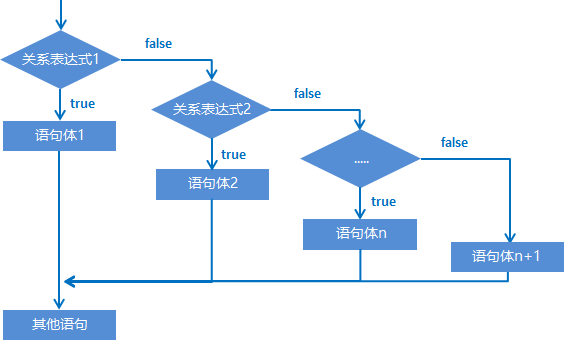

# 流程语句

## 流程控制语句（应用）

在一个程序执行的过程中，各条语句的执行顺序对程序的结果是有直接影响的。所以，我们必须清楚每条语句的执行流程。而且，很多时候要通过控制语句的执行顺序来实现我们想要的功能。

### 流程控制语句分类

​ 顺序结构

​ 分支结构(if, switch)

​ 循环结构(for, while, do…while)

### 顺序结构

顺序结构是程序中最简单最基本的流程控制，没有特定的语法结构，按照代码的先后顺序，依次执行，程序中大多数的代码都是这样执行的。

顺序结构执行流程图：


### 分支结构：if 语句

#### if 语句格式 1

```java
格式：
if (关系表达式) {
    语句体;
}
```

执行流程：

① 首先计算关系表达式的值

② 如果关系表达式的值为 true 就执行语句体

③ 如果关系表达式的值为 false 就不执行语句体

④ 继续执行后面的语句内容


示例：

```java
public class IfDemo {
	public static void main(String[] args) {
		System.out.println("开始");
		//定义两个变量
		int a = 10;
		int b = 20;
		//需求：判断a和b的值是否相等，如果相等，就在控制台输出：a等于b
		if(a == b) {
			System.out.println("a等于b");
		}
		//需求：判断a和c的值是否相等，如果相等，就在控制台输出：a等于c
		int c = 10;
		if(a == c) {
			System.out.println("a等于c");
		}
		System.out.println("结束");
	}
}
```

#### if 语句格式 2

```java
格式：
if (关系表达式) {
    语句体1;
} else {
    语句体2;
}
```

执行流程：

① 首先计算关系表达式的值

② 如果关系表达式的值为 true 就执行语句体 1

③ 如果关系表达式的值为 false 就执行语句体 2

④ 继续执行后面的语句内容


示例：

```java
public class IfDemo02 {
	public static void main(String[] args) {
		System.out.println("开始");
		//定义两个变量
		int a = 10;
		int b = 20;
		b = 5;
		//需求：判断a是否大于b，如果是，在控制台输出：a的值大于b，否则，在控制台输出：a的值不大于b
		if(a > b) {
			System.out.println("a的值大于b");
		} else {
			System.out.println("a的值不大于b");
		}
		System.out.println("结束");
	}
}
```

if 语句案例：奇偶数

需求：任意给出一个整数，请用程序实现判断该整数是奇数还是偶数，并在控制台输出该整数是奇数还是偶数。

分析：

​ ① 为了体现任意给出一个整数，采用键盘录入一个数据

​ ② 判断整数是偶数还是奇数要分两种情况进行判断，使用 if..else 结构

​ ③ 判断是否偶数需要使用取余运算符实现该功能 number % 2 == 0

​ ④ 根据判定情况，在控制台输出对应的内容

```java
import java.util.Scanner;
public class IfTest01 {
	public static void main(String[] args) {
		//为了体现任意给出一个整数，采用键盘录入一个数据。(导包，创建对象，接收数据)
		Scanner sc = new Scanner(System.in);
		System.out.println("请输入一个整数：");
		int number = sc.nextInt();
		//判断整数是偶数还是奇数要分两种情况进行判断，使用if..else结构
		//判断是否偶数需要使用取余运算符实现该功能 number % 2 == 0
		//根据判定情况，在控制台输出对应的内容
		if(number %2 == 0) {
			System.out.println(number + "是偶数");
		} else {
			System.out.println(number + "是奇数");
		}
	}
}
```

#### if 语句格式 3

```java
格式：
if (关系表达式1) {
    语句体1;
} else if (关系表达式2) {
    语句体2;
}
…
else {
    语句体n+1;
}
```

执行流程：

① 首先计算关系表达式 1 的值

② 如果值为 true 就执行语句体 1；如果值为 false 就计算关系表达式 2 的值

③ 如果值为 true 就执行语句体 2；如果值为 false 就计算关系表达式 3 的值

④…

⑤ 如果没有任何关系表达式为 true，就执行语句体 n+1。



示例：键盘录入一个星期数(1,2,...7)，输出对应的星期一，星期二，...星期日

```java
import java.util.Scanner;
public class IfDemo03 {
	public static void main(String[] args) {
		System.out.println("开始");
		// 需求：键盘录入一个星期数(1,2,...7)，输出对应的星期一，星期二，...星期日
		Scanner sc = new Scanner(System.in);
		System.out.println("请输入一个星期数(1-7)：");
		int week = sc.nextInt();
		if(week == 1) {
			System.out.println("星期一");
		} else if(week == 2) {
			System.out.println("星期二");
		} else if(week == 3) {
			System.out.println("星期三");
		} else if(week == 4) {
			System.out.println("星期四");
		} else if(week == 5) {
			System.out.println("星期五");
		} else if(week == 6) {
			System.out.println("星期六");
		} else {
			System.out.println("星期日");
		}
		System.out.println("结束");
	}
}
```

if 语句格式 3 案例：

需求：小明快要期末考试了，小明爸爸对他说，会根据他不同的考试成绩，送他不同的礼物，假如你可以控制小明的得分，请用程序实现小明到底该获得什么样的礼物，并在控制台输出。

分析：

​ ① 小明的考试成绩未知，可以使用键盘录入的方式获取值

​ ② 由于奖励种类较多，属于多种判断，采用 if...else...if 格式实现

​ ③ 为每种判断设置对应的条件

​ ④ 为每种判断设置对应的奖励

### 分支结构：switch 语句

##### switch 语句结构（掌握）

- 格式

  ```java
  switch (表达式) {
  	case 1:
  		语句体1;
  		break;
  	case 2:
  		语句体2;
  		break;
  	...
  	default:
  		语句体n+1;
  		break;
  }
  ```

* 执行流程：

  - 首先计算出表达式的值
  - 其次，和 case 依次比较，一旦有对应的值，就会执行相应的语句，在执行的过程中，遇到 break 就会结 束。
  - 最后，如果所有的 case 都和表达式的值不匹配，就会执行 default 语句体部分，然后程序结束掉。

##### switch 语句练习-春夏秋冬（应用）

- 需求：一年有 12 个月，分属于春夏秋冬 4 个季节，键盘录入一个月份，请用程序实现判断该月份属于哪个季节，并输出。
- 运行结果：

```
春：3、4、5
夏：6、7、8
秋：9、10、11
冬：1、2、12
```

- 示例代码：

```java
public class Demo1 {
    public static void main(String[] args) {
        //键盘录入月份数据，使用变量接收
        Scanner sc = new Scanner(System.in);
        System.out.println("请输入一个月份：");
        int month = sc.nextInt();
        //case穿透
        switch(month) {
            case 1:
            case 2:
            case 12:
                System.out.println("冬季");
                break;
            case 3:
            case 4:
            case 5:
                System.out.println("春季");
                break;
            case 6:
            case 7:
            case 8:
                System.out.println("夏季");
                break;
            case 9:
            case 10:
            case 11:
                System.out.println("秋季");
                break;
            default:
                System.out.println("你输入的月份有误");
        }
    }
}
```

- 注意：如果 switch 中得 case，没有对应 break 的话，则会出现 case 穿透的现象。

### 循环结构：for 循环

#### for 循环结构（掌握）

- 循环：

  循环语句可以在满足循环条件的情况下，反复执行某一段代码，这段被重复执行的代码被称为循环体语句，当反复 执行这个循环体时，需要在合适的时候把循环判断条件修改为 false，从而结束循环，否则循环将一直执行下去，形 成死循环。

- for 循环格式：

```java
for (初始化语句;条件判断语句;条件控制语句) {
	循环体语句;
}
```

- 格式解释：

  - 初始化语句： 用于表示循环开启时的起始状态，简单说就是循环开始的时候什么样
  - 条件判断语句：用于表示循环反复执行的条件，简单说就是判断循环是否能一直执行下去
  - 循环体语句： 用于表示循环反复执行的内容，简单说就是循环反复执行的事情
  - 条件控制语句：用于表示循环执行中每次变化的内容，简单说就是控制循环是否能执行下去

* 执行流程：

  ① 执行初始化语句

  ② 执行条件判断语句，看其结果是 true 还是 false

  ​ 如果是 false，循环结束; 如果是 true，继续执行

  ③ 执行循环体语句

  ④ 执行条件控制语句

  ⑤ 回到 ② 继续

#### for 循环练习-输出数据（应用）

- 需求：在控制台输出 1-5 和 5-1 的数据
- 示例代码：

```java
public class ForTest01 {
    public static void main(String[] args) {
		  //需求：输出数据1-5
      for(int i=1; i<=5; i++) {
        System.out.println(i);
      }
      System.out.println("--------");
      //需求：输出数据5-1
      for(int i=5; i>=1; i--) {
        System.out.println(i);
      }
    }
}
```

#### for 循环练习-求和（应用）

- 需求：求 1-5 之间的数据和，并把求和结果在控制台输出
- 示例代码：

```java
public class ForTest02 {
    public static void main(String[] args) {
		// 求和的最终结果必须保存起来，需要定义一个变量，用于保存求和的结果，初始值为0
		int sum = 0;
		//从1开始到5结束的数据，使用循环结构完成
		for(int i=1; i<=5; i++) {
			//将反复进行的事情写入循环结构内部
      // 此处反复进行的事情是将数据 i 加到用于保存最终求和的变量 sum 中
			sum += i;
			/*
				sum += i;	sum = sum + i;
				第一次：sum = sum + i = 0 + 1 = 1;
				第二次：sum = sum + i = 1 + 2 = 3;
				第三次：sum = sum + i = 3 + 3 = 6;
				第四次：sum = sum + i = 6 + 4 = 10;
				第五次：sum = sum + i = 10 + 5 = 15;
			*/
		}
		//当循环执行完毕时，将最终数据打印出来
		System.out.println("1-5之间的数据和是：" + sum);
    }
}
```

- 本题要点：
  - 今后遇到的需求中，如果带有求和二字，请立即联想到求和变量
  - 求和变量的定义位置，必须在循环外部，如果在循环内部则计算出的数据将是错误的

#### for 循环练习-求偶数和（应用）

- 需求：求 1-100 之间的偶数和，并把求和结果在控制台输出 }
- 示例代码：

```java
public class ForTest03 {
    public static void main(String[] args) {
		//求和的最终结果必须保存起来，需要定义一个变量，用于保存求和的结果，初始值为0
		int sum = 0;
		//对1-100的数据求和与1-5的数据求和几乎完全一样，仅仅是结束条件不同
		for(int i= 1; i <= 100; i++) {
			//对1-100的偶数求和，需要对求和操作添加限制条件，判断是否是偶数
			if(i % 2 == 0) {
				sum += i;
			}
		}
		//当循环执行完毕时，将最终数据打印出来
		System.out.println("1-100之间的偶数和是：" + sum);
    }
}
```

#### for 循环练习-水仙花（应用）

- 需求：在控制台输出所有的“水仙花数”
- 解释：什么是水仙花数？
  - 水仙花数，指的是一个三位数，个位、十位、百位的数字立方和等于原数
    - 例如`153  3*3*3 + 5*5*5 + 1*1*1 = 153`
- 思路：
  1. 获取所有的三位数，准备进行筛选，最小的三位数为 100，最大的三位数为 999，使用 for 循环获取
  2. 获取每一个三位数的个位，十位，百位，做 if 语句判断是否是水仙花数
- 示例代码

```java
public class ForTest04 {
    public static void main(String[] args) {
		//输出所有的水仙花数必然要使用到循环，遍历所有的三位数，三位数从100开始，到999结束
		for(int i=100; i<1000; i++) {
			//在计算之前获取三位数中每个位上的值
			int ge = i%10;
			int shi = i/10%10;
			int bai = i/10/10%10;

			//判定条件是将三位数中的每个数值取出来，计算立方和后与原始数字比较是否相等
			if(ge*ge*ge + shi*shi*shi + bai*bai*bai == i) {
				//输出满足条件的数字就是水仙花数
				System.out.println(i);
			}
		}
    }
}
```

#### for 循环练习-统计水仙花数个数（应用）

- 需求：统计“水仙花数”一共有多少个，并在控制台输出个数
- 示例代码：

```java
public class ForTest05 {
    public static void main(String[] args) {
		//定义变量count，用于保存“水仙花数”的数量，初始值为0
		int count = 0;
		//输出所有的水仙花数必然要使用到循环，遍历所有的三位数，三位数从100开始，到999结束
		for(int i=100; i<1000; i++) {
			//在计算之前获取三位数中每个位上的值
			int ge = i % 10;
			int shi = i / 10 % 10;
			int bai = i / 10 / 10 % 10;
			//在判定水仙花数的过程中，满足条件不再输出，更改为修改count的值，使count+1
			if(ge * ge * ge + shi * shi * shi + bai * bai * bai == i) {
				count++;
			}
		}
		//打印输出最终结果
		System.out.println("水仙花共有：" + count + "个");
    }
}
```

- 本题要点：
  - 今后如果需求带有统计 xxx，请先想到计数器变量
  - 计数器变量定义的位置，必须在循环外部

### 循环结构： while 循环

#### while 结构（掌握）

- while 循环完整格式：

  ```java
  初始化语句;
  while (条件判断语句) {
  	循环体语句;
      条件控制语句;
  }
  ```

- while 循环执行流程：

  ① 执行初始化语句

  ② 执行条件判断语句，看其结果是 true 还是 false

  ​ 如果是 false，循环结束

  ​ 如果是 true，继续执行

  ③ 执行循环体语句

  ④ 执行条件控制语句

  ⑤ 回到 ② 继续

* 示例代码：

```java
public class WhileDemo {
  public static void main(String[] args) {
    // 需求：在控制台输出5次"HelloWorld"
    // for循环实现
    for(int i = 1; i <= 5; i++) {
      System.out.println("HelloWorld");
    }
    System.out.println("--------");
    // while循环实现
    int j = 1;
    while(j <= 5) {
      System.out.println("HelloWorld");
      j++;
    }
  }
}
```

#### while 循环练习-珠穆朗玛峰（应用）

- 需求：世界最高山峰是珠穆朗玛峰(8844.43 米=8844430 毫米)，假如我有一张足够大的纸，它的厚度是 0.1 毫米。请问，我折叠多少次，可以折成珠穆朗玛峰的高度?
- 示例代码：

```java
public class WhileTest {
    public static void main(String[] args) {
		// 定义一个计数器，初始值为0
		int count = 0;
		//定义纸张厚度
		double paper = 0.1;
		// 定义珠穆朗玛峰的高度
		int zf = 8844430;
		// 因为要反复折叠，所以要使用循环，但是不知道折叠多少次，这种情况下更适合使用while循环
		// 折叠的过程中当纸张厚度大于珠峰就停止了，因此继续执行的要求是纸张厚度小于珠峰高度
		while(paper <= zf) {
			// 循环的执行过程中每次纸张折叠，纸张的厚度要加倍
			paper *= 2;
			// 在循环中执行累加，对应折叠了多少次
			count++;
		}
		//打印计数器的值
		System.out.println("需要折叠：" + count + "次");
    }
}
```

### 循环结构：do-while 循环

#### do...while 循环结构（掌握）

- 完整格式：

  ```java
  初始化语句;
  do {
  	循环体语句;
  	条件控制语句;
  }while(条件判断语句);
  ```

- 执行流程：

  ① 执行初始化语句

  ② 执行循环体语句

  ③ 执行条件控制语句

  ④ 执行条件判断语句，看其结果是 true 还是 false

  如果是 false，循环结束

  如果是 true，继续执行

  ⑤ 回到 ② 继续

* 示例代码：

```java
public class DoWhileDemo {
    public static void main(String[] args) {
        //需求：在控制台输出5次"HelloWorld"
		//for循环实现
		for(int i=1; i<=5; i++) {
			System.out.println("HelloWorld");
		}
		System.out.println("--------");
		//do...while循环实现
		int j = 1;
		do {
			System.out.println("HelloWorld");
			j++;
		}while(j<=5);
    }
}
```

### 三种循环的区别（理解）

- 三种循环的区别
  - for 循环和 while 循环先判断条件是否成立，然后决定是否执行循环体（先判断后执行）
  - do...while 循环先执行一次循环体，然后判断条件是否成立，是否继续执行循环体（先执行后判断）
- for 循环和 while 的区别
  - 条件控制语句所控制的自增变量，因为归属 for 循环的语法结构中，在 for 循环结束后，就不能再次被访问到了
  - 条件控制语句所控制的自增变量，对于 while 循环来说不归属其语法结构中，在 while 循环结束后，该变量还可以继续使用
- 死循环（无限循环）的三种格式
  1. for(;;){}
  2. while(true){}
  3. do {} while(true);

### 跳转控制语句（掌握）

- 跳转控制语句（break）
  - 跳出循环，结束循环
- 跳转控制语句（continue）
  - 跳过本次循环，继续下次循环
- 注意： continue 只能在循环中进行使用！

### 循环嵌套（理解）

- 循环嵌套概述：在循环中，继续定义循环

- 示例代码：

  ```java
  	public static void main(String[] args) {
          //外循环控制小时的范围，内循环控制分钟的范围
          for (int hour = 0; hour < 24; hour++) {
              for (int minute = 0; minute < 60; minute++) {
                  System.out.println(hour + "时" + minute + "分");
              }
              System.out.println("--------");
          }
      }
  ```

* 理解：

  - 请反复理解这句话（整个内循环，就是外循环的一个循环体，内部循环体没有执行完毕，外循环是不会继续向下执行的）

* 结论：

  - 外循环执行一次，内循环执行一圈

### Random

#### Random 产生随机数（掌握）

- 概述：

  - Random 类似 Scanner，也是 Java 提供好的 API，内部提供了产生随机数的功能
    - API 后续课程详细讲解，现在可以简单理解为 Java 已经写好的代码

* 使用步骤：

  1. 导入包

     import java.util.Random;

  2. 创建对象

     Random r = new Random();

  3. 产生随机数

     int num = r.nextInt(10);

     解释： 10 代表的是一个范围，如果括号写 10，产生的随机数就是 0-9，括号写 20，参数的随机数则是 0-19

* 示例代码：

```java
import java.util.Random;
public class RandomDemo {
	public static void main(String[] args) {
		//创建对象
		Random r = new Random();
		//用循环获取10个随机数
		for(int i = 0; i < 10; i++) {
			//获取随机数
			int number = r.nextInt(10);
			System.out.println("number:" + number);
		}
		//需求：获取一个1-100之间的随机数
		int x = r.nextInt(100) + 1;
		System.out.println(x);
	}
}
```
