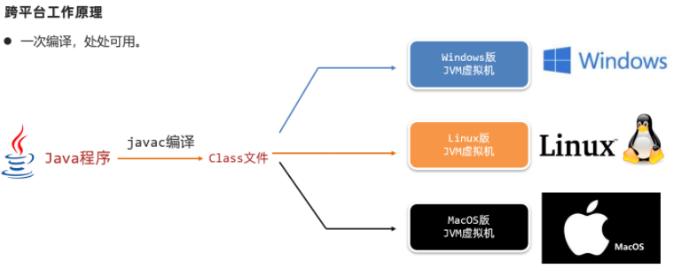
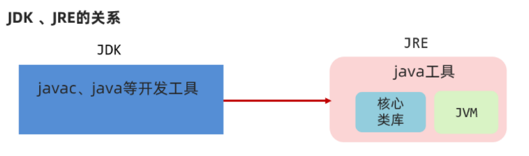
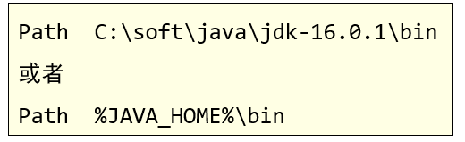

---
nav:
  title: 基础
  order: 0
---

# 介绍

## 概述

### 1.1 Java 语言发展史（了解）

语言：人与人交流沟通的表达方式

计算机语言：人与计算机之间进行信息交流沟通的一种特殊语言

Java 语言是美国 Sun 公司（Stanford University Network）在 1995 年推出的计算机语言

Java 之父：詹姆斯·高斯林（James Gosling）2009 年，Sun 公司被甲骨文公司收购，所以我们现在访问 oracle 官网即可：[https://www.oracle.com](https://www.oracle.com/)
当前，我们使用的 JDK 版本：11.0

### 1.2 Java 语言跨平台原理（理解）

Java 程序并非是直接运行的，Java 编译器将 Java 源程序编译成与平台无关的字节码文件(class 文件)，然后由 Java 虚拟机（JVM）对字节码文件解释执行。所以在不同的操作系统下，只需安装不同的 Java 虚拟机即可实现 java 程序的跨平台。


### 1.3 JRE 和 JDK（记忆）



JVM（Java Virtual Machine），Java 虚拟机

JRE（Java Runtime Environment），Java 运行环境，包含了 JVM 和 Java 的核心类库（Java API）

JDK（Java Development Kit）称为 Java 开发工具，包含了 JRE 和开发工具

总结：我们只需安装 JDK 即可，它包含了 java 的运行环境和虚拟机。

### 1.4 JDK 的下载和安装（应用）

#### 1.4.1 下载

通过官方网站获取 JDK

[http://www.oracle.com](http://www.oracle.com/)

**注意**：针对不同的操作系统，需要下载对应版本的 JDK。

具体下载步骤请参见《JDK 下载及安装说明文档》

#### 1.4.2 安装

傻瓜式安装，下一步即可。但默认的安装路径是在 C:\Program Files 下，为方便统一管理建议修改安装路径，将与开发相关的软件都安装到一个目录下，例如：E:\develop。

**注意**：安装路径不要包含中文或者空格等特殊字符（使用纯英文目录）。

具体安装步骤请参见《JDK 下载及安装说明文档》

#### 1.4.3 JDK 的安装目录介绍

| 目录名称 | 说明                                                              |
| -------- | ----------------------------------------------------------------- |
| bin      | 该路径下存放了 JDK 的各种工具命令。javac 和 java 就放在这个目录。 |
| conf     | 该路径下存放了 JDK 的相关配置文件。                               |
| include  | 该路径下存放了一些平台特定的头文件。                              |
| jmods    | 该路径下存放了 JDK 的各种模块。                                   |
| legal    | 该路径下存放了 JDK 各模块的授权文档。                             |
| lib      | 该路径下存放了 JDK 工具的一些补充 JAR 包。                        |

## 2. 入门程序 HelloWorld

### 2.1 常用 DOS 命令（应用）

在接触集成开发环境之前，我们需要使用命令行窗口对 java 程序进行编译和运行，所以需要知道一些常用 DOS 命令。

1、打开命令行窗口的方式：win + r 打开运行窗口，输入 cmd，回车。

2、常用命令及其作用
| 操作 | 说明 |
| -------------- | ------------------------ |
| 盘符名称: | 盘符切换。E:回车，表示切换到 E 盘。 |
| dir | 查看当前路径下的内容。 |
| cd 目录 | 进入单级目录。cd test |
| cd .. | 回退到上一级目录。 |
| cd 目录 1 \ 目录 2 \... | 进入多级目录。cd test\JavaSE |
| cd \ | 回退到盘符目录。 |
| cls | 清屏。 |
| exit | 退出命令提示符窗口。 |

### 2.2 Path 环境变量的配置（应用）

#### 2.2.1 为什么配置环境变量

开发 Java 程序，需要使用 JDK 提供的开发工具（比如 javac.exe、java.exe 等命令），而这些工具在 JDK 的安装目录的 bin 目录下，如果不配置环境变量，那么这些命令只可以在该目录下执行。我们不可能把所有的 java 文件都放到 JDK 的 bin 目录下，所以配置环境变量的作用就是可以使 bin 目录下的 java 相关命令可以在任意目录下使用。

注意：目前较新的 JDK 安装时会自动配置 javac、java 命令的路径到 Path 环境变量中去 ，所以 javac、java 可以直接使用。


但是以前下载的老版本的 JDK 是没有自动配置的，此时必需要自己配置 Path 环境变量。

①**JAVA_HOME**：告诉操作系统 JDK 安装在了哪个位置（未来其他技术要通过这个找 JDK）


②**Path**：告诉操作系统 JDK 提供的 javac(编译)、java(执行)命令安装到了哪个位置



**注意：新版本的 JDK 只是自动配置了 Path，没有自动配置 JAVA_HOME。**

### 2.3 HelloWorld 案例（应用）

HelloWorld 案例是指在计算机屏幕上输出“HelloWorld”这行文字。各种计算机语言都习惯使用该案例作为第一个演示案例。

#### 2.3.1 Java 程序开发运行流程

开发 Java 程序，需要三个步骤：编写程序，编译程序，运行程序。

#### 2.3.2 HelloWorld 案例的编写

1、新建文本文档文件，修改名称为 HelloWorld.java。

2、用记事本打开 HelloWorld.java 文件，输写程序内容。

```java
public class HelloWorld {
    public static void main(String[] args) {
        System.out.println("HelloWorld");
    }
}
```

#### 2.3.3 HelloWorld 案例的编译和运行

存文件，打开命令行窗口，将目录切换至 java 文件所在目录，编译 java 文件生成 class 文件，运行 class 文件。

> 编译：javac 文件名.java
>
> 范例：javac HelloWorld.java
>
> 执行：java 类名
>
> 范例：java HelloWorld

### 2.4 HelloWorld 案例常见问题（理解）

#### 2.4.1 BUG

在电脑系统或程序中，隐藏着的一些未被发现的缺陷或问题统称为 bug（漏洞）。

#### 2.4.2 BUG 的解决

1、具备识别 BUG 的能力：多看

2、具备分析 BUG 的能力：多思考，多查资料

3、具备解决 BUG 的能力：多尝试，多总结

#### 2.4.3 HelloWorld 案例常见问题

1、非法字符问题。Java 中的符号都是英文格式的。

2、大小写问题。Java 语言对大小写敏感（区分大小写）。

3、在系统中显示文件的扩展名，避免出现 HelloWorld.java.txt 文件。

4、编译命令后的 java 文件名需要带文件后缀.java

5、运行命令后的 class 文件名（类名）不带文件后缀.class

...

## 3、IDEA 安装使用

参见**“IDEA 安装详解.pdf”**
